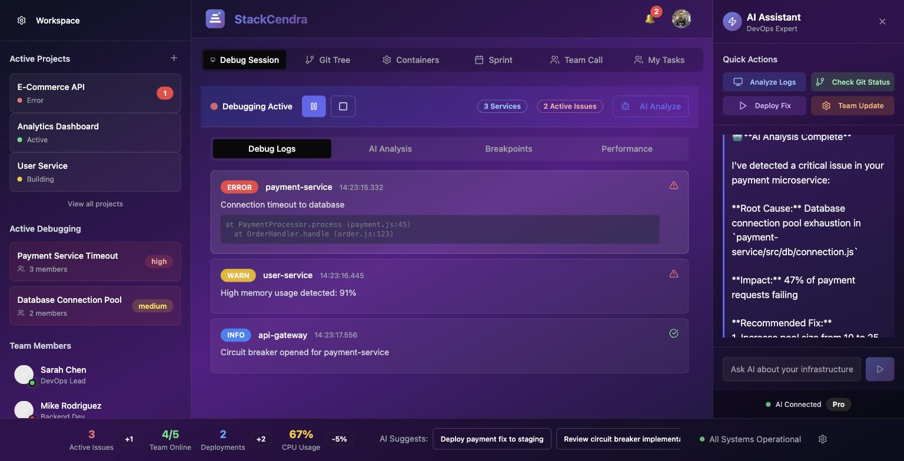
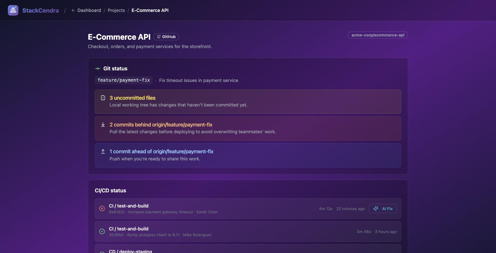

# StackCendra

**From local development to verified production recovery—without switching tools.**

StackCendra is an AI-native engineering workspace designed to understand source code, configuration, local environments, remote infrastructure, deployments, and production telemetry. Its first goal is deliberately focused:

> Detect, reproduce, and resolve environment-related failures across local development and production.

**Live:** [stackcendra.com](https://stackcendra.com)

| Debug session with AI assistant | Project Git + CI/CD status |
| --- | --- |
|  |  |

<sub>Screens show sample workspace data.</sub>

## Project status

StackCendra is in **Phase 0: Foundation and product architecture**.

The web app runs on Next.js App Router and is deployed at [stackcendra.com](https://stackcendra.com) (Vercel), with a self-hosted instance and its PostgreSQL database on a VM, deployed by CI on every push to `main` (see [deploy/README.md](deploy/README.md)). What is real today:

- **Sign-in with GitHub or Google.** Email/password is still concept UI.
- **GitHub and GitLab integrations:** access tokens are encrypted (AES-256-GCM) before storage and only decrypted server-side; GitLab tokens auto-refresh. The integrations page shows live CI/CD activity from connected repositories.

The dashboard, project views, debug session and AI assistant are still interface concepts running on sample data. They are not yet connected to a desktop agent, container runtime, cloud account, or AI investigation service. See [Concept UI Screens](docs/wiki/Concept-UI-Screens.md) for the running screen inventory.

## Documentation

The complete Phase 0–13 planning documentation is versioned in [`docs/wiki`](docs/wiki/Home.md), which remains the canonical review history. The same reviewed page set is published to the [hosted StackCendra Wiki](https://github.com/keshav-019/stackcendra/wiki).

Start with:

- [Product vision and scope](docs/wiki/Product-Vision-and-Scope.md)
- [Phase 0 plan](docs/wiki/Phase-0-Foundation.md)
- [Phase 0 execution backlog](docs/wiki/Phase-0-Execution-Backlog.md)
- [Phase delivery framework](docs/wiki/Phase-Delivery-Framework.md)
- [Complete capability roadmap](docs/wiki/Roadmap.md)
- [Wiki review guide](docs/wiki/Wiki-Review-Guide.md)
- [System architecture](docs/wiki/System-Architecture.md)
- [Security and trust model](docs/wiki/Security-and-Trust-Model.md)
- [Toolchain setup record](docs/wiki/Toolchain-Setup-Record.md)
- [Release 0.1: project discovery](docs/wiki/Release-0.1-Project-Discovery.md)
- [Architecture decisions](docs/wiki/Architecture-Decisions.md)

## Product workflow

```text
Discover project
  → understand configuration
  → generate and validate an environment
  → develop and test
  → review and deploy through controlled flows
  → observe runtime behavior
  → diagnose incidents with evidence
  → reproduce failures locally
  → verify recovery and prevent recurrence
```

## Planned platform boundaries

| Technology | Responsibility |
| --- | --- |
| Next.js and TypeScript | Web experience and shared product interface |
| Tauri 2 and Rust | Desktop shell, local discovery, terminals, credentials, SSH, and Docker access |
| Go | Infrastructure control plane and provider integrations |
| Python | Evidence-driven repository and incident intelligence |
| NestJS | Presence, collaboration, WebSockets, and notifications |
| PostgreSQL | Core product state and resource relationships |
| Temporal | Durable, approval-based automation |
| OpenTelemetry | Correlation across code, deployments, configuration, and runtime behavior |

These are target responsibility boundaries, not permission to deploy every component as a separate service immediately. StackCendra begins as a modular system with the smallest useful number of runtime units.

## Engineering principles

1. Build one complete workflow, not twenty shallow products.
2. Every diagnosis must link claims to evidence.
3. AI proposes; policy validates; humans approve; constrained runners execute.
4. Secrets do not enter ordinary prompts, logs, Git, or browser storage.
5. Every release must be independently demonstrable and useful.
6. Local and customer-hosted execution handle sensitive or expensive work.
7. Architecture evolves only when measured requirements justify additional complexity.

## Near-term releases

| Release | Promise |
| --- | --- |
| 0.1 | Detect and explain local projects |
| 0.2 | Understand configuration requirements |
| 0.3 | Compare environments and prevent drift |
| 0.4 | Securely connect to remote hosts |
| 0.5 | Automate repeatable remote actions |
| 0.6 | Build health-gated deployment flows |
| 0.7 | Correlate Git, deployment, and configuration |
| 0.8 | Inspect Docker and Kubernetes |
| 0.9 | Diagnose incidents using evidence |
| 1.0 | Reproduce production failures locally |

## Running the web app locally

Needs Node 22 (`.nvmrc`) and Docker.

```bash
npm ci
cp .env.example .env.local   # then set AUTH_SECRET, INTEGRATION_ENCRYPTION_KEY and
                             # DATABASE_URL=postgres://stackcendra@localhost:5433/stackcendra_dev
npm run db:up                # Postgres 18 with stackcendra_dev and stackcendra_test
npm run db:migrate
npm run dev                  # http://localhost:8080
```

Tests: `npm test` (unit/component), `npm run test:api` (route handlers against the
test database), `npm run test:e2e` (Playwright, starts its own server on port 3100).
See [Testing, Quality, and Observability](docs/wiki/Testing-Quality-and-Observability.md).
Deployment and CI/CD: [deploy/README.md](deploy/README.md).
