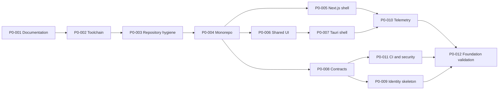

# Phase 0 Execution Backlog

## Purpose

This backlog converts the Phase 0 outcome into ordered, reviewable work packages. Status reflects the repository at the start of Phase 0 and is updated as work is completed.

## Dependency chain

## Work packages

### P0-001 — Documentation baseline

**Status:** Local source complete; hosted Wiki blocked by private-repository feature availability

Deliver:

- StackCendra README;
- versioned Wiki source and hosted GitHub Wiki;
- product, architecture, security, data, quality, and roadmap pages;
- initial ADRs;
- terminology and release 0.1 acceptance criteria.

Accept when:

- internal links validate;
- README contains no Lovable identity;
- hosted Wiki and `docs/wiki` match;
- open decisions and risks are visible.

### P0-002 — Foundation toolchain

**Status:** Installed; Docker first-launch verification pending

Deliver:

- Node.js 24 LTS;
- pnpm 10 through Corepack;
- Rust stable MSVC, rustfmt, and clippy;
- Docker Desktop with Compose v2 and WSL 2 backend;
- verified Git, Visual C++ tools, WebView2, and WSL;
- recorded exact versions.

Accept when:

- verification commands succeed from a fresh terminal;
- Docker engine can run a disposable hello-world container after the user reviews its agreement;
- no unsupported Node runtime remains active.

### P0-003 — Repository hygiene

**Status:** Planned

Deliver:

- remove obsolete Lovable metadata and packages;
- choose and enforce the pnpm lockfile;
- add license decision, contribution guidance, code of conduct if public collaboration begins, and security policy;
- define branch, commit, changelog, and release conventions;
- add editor configuration and safe ignores.

Accept when:

- repository identity is consistently StackCendra;
- no conflicting JavaScript lockfiles remain;
- dependency and ownership policies are documented.

### P0-004 — Monorepo foundation

**Status:** Planned

Deliver:

- `pnpm-workspace.yaml`;
- root package metadata and pinned package manager;
- `apps`, `packages`, and active language directories;
- shared TypeScript, lint, and formatting policies;
- root validation commands;
- dependency-boundary checks.

Accept when:

- a clean checkout installs with a frozen lockfile;
- root validation discovers every active package;
- inactive future services are not scaffolded merely to fill the tree.

### P0-005 — Next.js web shell

**Status:** Lightweight shell in place; full scope still planned

Delivered so far:

- Next.js App Router application (Next.js 15.x, React 19) running in place of the Vite prototype;
- root layout, providers boundary, and global styles carried over from the prototype design system;
- `/`, `/login`, and `/signup` routes; the dashboard is intentionally unguarded — no auth gate exists yet;
- no Vite, React Router, or Lovable scaffolding remains in the web shell;
- production build (`next build`) passes with linting and type checking enabled.

Still outstanding for full P0-005 completion:

- upgrade to the pinned Next.js 16.2 Active LTS release once it is broadly stable and the pnpm workspace (P0-004) exists to pin it in;
- routes matching the complete release 0.1 information architecture (Home / Develop / Configure / Connect / Automate / Operate / Resolve / Govern), not only the dashboard, login, and signup concept screens;
- a real authenticated-shell boundary once an identity provider is selected (P0-009);
- query and client-state boundaries formalized beyond the current `TooltipProvider`/`QueryClientProvider` wrapper.

Accept when:

- the application runs through documented commands;
- routes match the release 0.1 information architecture;
- no Vite or React Router runtime dependency remains in the web shell;
- current security patches are pinned.

### P0-006 — Shared design system and interface alignment

**Status:** Planned

Deliver:

- shared UI package and design tokens;
- accessible navigation, forms, tables, graphs, status, and evidence components;
- product terminology applied throughout;
- future sprint/video features removed from primary navigation.

Accept when:

- web and desktop can consume the same components;
- keyboard and screen-reader checks pass for the foundation shell;
- mock state is clearly labeled and isolated.

### P0-007 — Tauri desktop shell

**Status:** Planned

Deliver:

- Tauri 2 application;
- explicit command allowlist;
- safe window, update, deep-link, tray, notification, and storage policies;
- desktop-compatible shared UI entry;
- development signing and capability configuration.

Accept when:

- Tauri runs using the Rust stable MSVC toolchain;
- a harmless version command crosses the typed IPC boundary;
- unregistered commands are denied;
- web builds contain no privileged desktop bridge.

### P0-008 — Shared contracts

**Status:** Planned

Deliver:

- identifier, error, pagination, evidence, event, and audit conventions;
- representative OpenAPI, Protocol Buffer, and JSON Schema contracts;
- schema validation and compatibility tests;
- generated-client policy.

Accept when:

- active languages validate representative messages;
- breaking contract changes fail CI;
- secret fields are classified explicitly.

### P0-009 — Identity and domain skeleton

**Status:** Started — user and OAuth account persistence only

Delivered so far:

- real `users` and `accounts` tables in the provisioned Neon Postgres database (`db/auth-schema.sql`), populated via the official Auth.js Postgres adapter on every GitHub sign-in — see [ADR 0010](https://github.com/keshav-019/stackcendra/wiki/ADR-0010-Postgres-User-Persistence);
- every route except `/login`/`/signup` now requires a real session (see [ADR 0009](https://github.com/keshav-019/stackcendra/wiki/ADR-0009-Route-Gating)), which is the first authorization gate, though it is not yet the full authorization model below.

Still outstanding for full P0-009 completion:

- organization, membership, project, repository, service, and environment models;
- development-only device-pairing flow;
- authorization interfaces without premature enterprise features;
- audit-event persistence path;
- a chosen migration tool (the current schema is applied by hand — see the open decision in [Risks, Non-Goals, and Decision Log](https://github.com/keshav-019/stackcendra/wiki/Risks-Non-Goals-and-Decision-Log)).

Accept when:

- a development user can create an organization and project and pair one device;
- tenant isolation and denial paths are tested;
- no production authentication claim is made.

### P0-010 — Observability baseline

**Status:** Planned

Deliver:

- OpenTelemetry initialization;
- trace and correlation propagation;
- structured logging and redaction;
- local collector profile;
- baseline metrics for active components.

Accept when:

- a representative web request and desktop command are traceable;
- secrets and high-cardinality paths are absent from exported telemetry;
- telemetry failure does not break product behavior.

### P0-011 — CI, supply chain, and security baseline

**Status:** Planned

Deliver:

- formatting, linting, type checking, tests, and contract validation;
- secret scanning and dependency review;
- artifact provenance and SBOM plan;
- Windows and Linux matrices for active components;
- cache policy that does not compromise reproducibility.

Accept when:

- required checks block an intentionally failing change;
- fixture tests run on supported platforms;
- release artifacts can be traced to source and workflow.

### P0-012 — Foundation validation

**Status:** Planned

Deliver:

- clean-machine setup rehearsal;
- Phase 0 demonstration;
- documentation reconciliation;
- risk and decision review;
- release 0.1 kickoff checklist.

Accept when:

- every Phase 0 exit criterion has linked evidence;
- unresolved questions do not block release 0.1;
- setup works from the documented commands;
- the project makes no claim unsupported by running behavior.

## Execution rules

- Work packages are completed in dependency order unless a documented reason permits parallel work.
- Each package ends with evidence, not only changed files.
- Product, security, and contract documentation changes accompany implementation.
- A work package may be split into issues, but its acceptance criteria remain stable unless a decision record changes them.
- Tool or framework upgrades during Phase 0 are explicit changes, not incidental lockfile movement.
