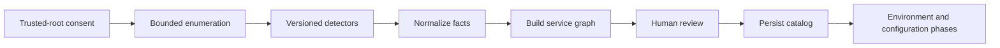

# Phase 1: Intelligent Local Project Discovery

## Outcome

StackCendra turns a user-approved directory into an evidence-backed catalog of repositories, services, runtimes, tools, ports, data stores, and dependencies without executing project code.

This is the first compelling public demonstration and the factual foundation for every later phase.

## Capability and release mapping

- Capability phase: 1
- First marketed in: release 0.1
- Primary surface: Tauri desktop application
- Primary owner: Rust local agent
- Supporting surfaces: shared React project view and contract package

The detailed release contract is defined in [Release 0.1 Project Discovery](https://github.com/keshav-019/stackcendra/wiki/Release-0.1-Project-Discovery). This page defines how the capability is delivered and handed to later phases.

## Prerequisites

- Phase 0 trust boundaries, contracts, telemetry, and repository foundation are complete.
- The desktop application can request a user-selected directory.
- The local agent has a deny-by-default filesystem capability.
- Fixture repositories exist for every promised ecosystem.

## User journey

1. The user selects a trusted root and reviews exclusions.
2. StackCendra discovers repositories and workspace boundaries.
3. Deterministic detectors stream facts with evidence and confidence.
4. The system constructs services and dependency edges.
5. The user reviews conflicts, corrects facts, and saves the catalog.
6. A later rescan evaluates only changed inputs and preserves user corrections.

## Functional scope

### Repository discovery

- Git roots, worktrees, nested repositories, and monorepo workspaces
- ignored, generated, vendored, and binary-directory exclusions
- current commit, branch, and dirty-state metadata
- constrained handling of symlinks and Windows junctions

### Ecosystem detectors

| Area | Initial evidence |
| --- | --- |
| JavaScript and TypeScript | `package.json`, npm, pnpm, Yarn, Bun, Next.js, React, Express, NestJS, Angular, Vite |
| Python | requirements files, `pyproject.toml`, Poetry, Pipenv, FastAPI, Flask, Django |
| Java | Maven, Gradle, Spring Boot |
| Go | `go.mod`, `go.work`, command packages |
| Rust | `Cargo.toml`, workspaces, binary targets |
| C and C++ | CMake, Meson, Make |
| Infrastructure | Dockerfile, Compose, Kubernetes, Helm, Terraform, GitHub Actions |

### Derived project model

- stack and framework identification;
- confidence score and conflicting evidence;
- runtime and package-manager requirements;
- database and cache inference;
- service-to-service dependency edges;
- required and occupied ports as observations;
- missing local tooling;
- editable analysis and persisted project catalog.

## Detection approach

Each detector is a pure, versioned module with declared inputs and emitted fact types. Parsing structured manifests is preferred over regular expressions; bounded source inspection is used only for high-value facts such as known port APIs.

A fact is not accepted without:

- subject, kind, and normalized value;
- confidence and source category;
- file and location or equivalent manifest pointer;
- detector version and observation time;
- redaction status;
- confirmed, corrected, rejected, or unreviewed state.

User corrections are stored as overlays. They never rewrite detector history, and a rescan must surface conflicts between new evidence and prior corrections.

## Data and contracts

Phase 1 creates or enriches:

- `Project`, `Repository`, and `Service`;
- `DetectedFact` and `EvidenceReference`;
- `ResourceNode` and `ResourceEdge`;
- `ToolRequirement`, `RuntimeRequirement`, and `PortRequirement`;
- `ProjectScan` and `UserCorrection`.

Important events:

- `project.scan.started`;
- `project.detected`;
- `service.detected`;
- `project.fact.corrected`;
- `project.scan.completed`;
- `project.scan.failed`.

## Security and privacy

- Scanning begins only after explicit directory selection.
- Canonical-path checks prevent traversal outside the trusted root.
- Repository commands, package scripts, and binaries are never executed.
- Network access is disabled for the detector pipeline.
- Secret-like literals are redacted before persistence, logs, or telemetry.
- Evidence excerpts are minimal, bounded, and stored by hash where content is unnecessary.
- The user can cancel, delete the catalog, and inspect what was retained.

## Work packages

1. Build safe traversal, exclusions, cancellation, and incremental fingerprints.
2. Define the fact, evidence, conflict, and correction contracts.
3. Implement manifest-first detectors and fixture tests by ecosystem.
4. Add dependency, port, runtime, and tool inference.
5. Build the project graph and evidence inspector.
6. Persist catalog snapshots and correction overlays.
7. Add performance, privacy, and cross-platform validation.
8. Package the mixed-language portfolio demonstration.

## Quality strategy

- unit tests for every detector rule;
- golden fixture tests for normalized output;
- mutation cases for malformed and adversarial manifests;
- filesystem boundary, symlink, junction, and cancellation tests;
- Windows and Linux parity tests;
- secret canaries proving redaction;
- incremental-scan benchmarks;
- false-positive and false-negative review corpus.

Telemetry measures duration, file counts, detector failures, cache hits, and confidence distribution. It must never contain source text or secret values.

## Deliverables

- versioned detector SDK;
- supported-ecosystem fixture suite;
- trusted-root scan service;
- project catalog and dependency graph;
- evidence and correction interface;
- sanitized discovery report export;
- detector support matrix and known-limitations page.

## Exit gate

Phase 1 is complete when the maintained mixed-language fixture is correctly represented as five application services plus its data services, all expected dependency edges are visible, every fact is evidence-backed or labeled as a hypothesis, no code executes, secrets do not leak, cancellation works, and unchanged rescans are measurably incremental.

## Risks and controls

| Risk | Control |
| --- | --- |
| False confidence from heuristic detection | Show evidence, confidence, conflicts, and user correction state |
| Scanning sensitive paths | Explicit trusted root, exclusions, canonical-path enforcement |
| Excessive scan time | Incremental fingerprints, bounded concurrency, early streaming |
| Detector regressions | Versioned detectors and golden fixtures |
| Phase 1 becoming an AI demo | Deterministic facts first; AI can explain but cannot invent facts |

## Non-goals

- writing project files;
- installing dependencies;
- starting services;
- probing live databases;
- uploading source code;
- remote repository indexing;
- generating environments or configuration.

## Handoff to Phase 2

Phase 2 consumes a confirmed project snapshot, not raw scanner guesses. It uses service commands, runtimes, ports, data dependencies, and graph edges as proposals for generating a local environment.
