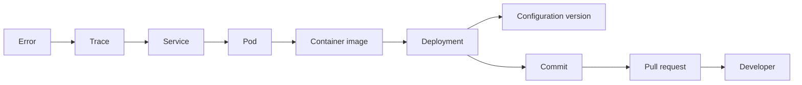

# Phase 10: Observability and Incident Intelligence

## Outcome

StackCendra creates incidents from operational signals and produces ranked, evidence-linked root-cause hypotheses that correlate code, configuration, deployments, runtime topology, cloud events, and telemetry rather than merely summarizing logs.

## Capability and release mapping

- Capability phase: 10
- First marketed in: release 0.9
- Telemetry foundation: OpenTelemetry Collector, Prometheus, Grafana, Loki, and Tempo
- Primary owners: Go control plane and Python intelligence service
- Authorization rule: AI investigates and proposes; humans and policy authorize

## Prerequisites

- Services, environments, configuration, deployments, Git, runtime, and cloud resources have stable identities.
- Correlation IDs propagate across active components.
- Telemetry retention, redaction, sampling, and tenancy rules are enforced.
- Remediation uses Actions and flows rather than a direct AI execution path.

## Supported evidence

- logs;
- metrics;
- traces;
- deployment events;
- configuration changes;
- host events;
- container and Kubernetes events;
- Git activity;
- user and automation actions.

Every evidence item records source, observed time, event time, query, tenant, retention class, and integrity metadata.

## Correlation model

Correlation uses trace context, resource attributes, image digests, deploy annotations, configuration versions, event time, and graph relationships. Temporal proximity alone is supporting evidence, not proof.

## Incident creation

Initial deterministic triggers:

- error-rate threshold;
- latency spike;
- crash loop;
- failed health check;
- resource exhaustion;
- configuration drift;
- failed deployment;
- secret expiration;
- certificate expiration.

Trigger rules declare evaluation window, baseline, severity, deduplication key, recovery condition, ownership, and suppression policy.

## Investigation lifecycle

1. Create or update an incident from a deterministic trigger.
2. Freeze a time-bounded evidence manifest.
3. traverse related service, deployment, configuration, Git, and runtime nodes.
4. Run approved, bounded evidence queries.
5. Generate candidate hypotheses.
6. score each hypothesis against supporting and contradicting evidence.
7. present likely root cause, confidence, recommended action, and risk.
8. require user review and policy before any remediation Action.
9. verify recovery against the same health evidence.

## AI investigator contract

The Python intelligence service returns:

- concise hypothesis;
- confidence calibrated to available evidence;
- supporting and contradicting evidence references;
- causal timeline;
- missing information and suggested safe queries;
- recommended remediation;
- estimated operational risk;
- alternative hypotheses.

Every factual claim links to evidence. Unavailable evidence and uncertainty are stated. The service has no credential-export, approval, or runner-execution capability.

## Example investigation

Likely cause: payment-service configuration drift.

Evidence:

- error increase began after the canary deployment;
- production timeout differs from the validated staging value;
- the deployed commit increased downstream request duration;
- traces terminate retries at the production timeout.

Recommended action: restore the last validated timeout through a versioned configuration Action and restart only the canary.

The recommendation remains a proposal until policy and required people approve it.

## Data and events

Phase 10 adds:

- `TelemetrySource`, `EvidenceQuery`, and immutable `EvidenceItem`;
- `Incident`, `IncidentSignal`, and `IncidentTimelineEntry`;
- `Hypothesis`, `EvidenceLink`, and `InvestigationRun`;
- `RemediationProposal` and `RecoveryVerification`.

Important events:

- `incident.signal.triggered`;
- `incident.created`;
- `incident.evidence.attached`;
- `ai.hypothesis.generated`;
- `remediation.proposed`;
- `remediation.approved`;
- `remediation.executed`;
- `incident.recovered`.

## Security, privacy, and cost

- redact before ingestion where possible;
- enforce tenant isolation in queries, storage, caches, and vector indexes;
- exclude secrets and raw customer data from ordinary AI prompts;
- support local or bring-your-own-key inference;
- store prompt and model metadata without sensitive payloads;
- limit query time ranges and cardinality;
- sample high-volume traces and retain bounded incident evidence;
- record which model and evidence produced each hypothesis.

## Work packages

1. Establish telemetry schemas, resource identity, and correlation requirements.
2. Integrate Collector, Prometheus, Loki, Tempo, and deployment events.
3. Implement trigger, deduplication, severity, and recovery rules.
4. Build evidence manifest and graph traversal.
5. Implement the Python hypothesis contract and evaluation harness.
6. Add timeline, hypothesis, evidence, and uncertainty interface.
7. Connect reviewed remediation to Actions and flows.
8. Add recovery verification, incident export, and postmortem inputs.

## Quality strategy

- synthetic incident fixtures with known ground truth;
- trace-to-deployment and configuration correlation tests;
- clock-skew, missing-telemetry, and duplicate-signal scenarios;
- tenant-isolation and redaction tests;
- AI evaluation for evidence citation, unsupported claims, calibration, and refusal;
- prompt-injection tests using hostile log content;
- remediation authorization tests;
- ingestion volume, retention, and query-budget tests.

## Exit gate

Phase 10 is complete when an injected configuration-and-latency incident produces a hypothesis connecting Git, configuration, deployment, logs, metrics, and traces; each claim links to evidence; uncertainty is visible; the recommended Action requires approval; and recovery is verified using health evidence.

## Risks and controls

| Risk | Control |
| --- | --- |
| AI invents a confident cause | Evidence-required claims, alternatives, and calibration tests |
| Logs contain prompt injection | Treat telemetry as untrusted data and isolate instructions |
| Correlation mistakes coincidence for cause | Multiple evidence types and contradicting evidence |
| Telemetry costs dominate | Sampling, bounded retention, query budgets, local processing |
| Investigator becomes an execution authority | No execution capability; Actions and policy remain mandatory |

## Non-goals

- replacing Grafana or every observability vendor;
- unrestricted historical log storage;
- autonomous production remediation;
- claiming certainty when evidence is incomplete;
- sending arbitrary private telemetry to a hosted model.

## Handoff to Phase 11

Phase 11 converts a selected incident, evidence manifest, deployment, commit, and configuration contract into a sanitized, isolated local reproduction.
