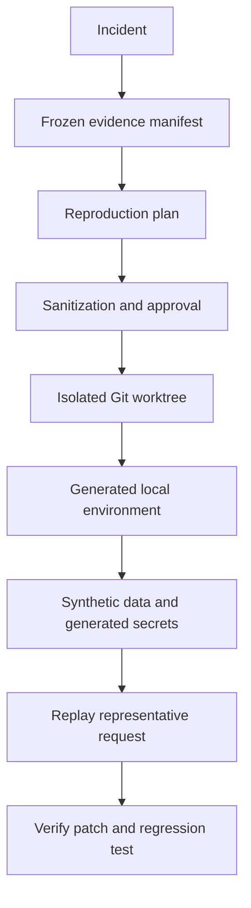

# Phase 11: Production-to-Local Reproduction

## Outcome

A developer can recreate a production failure in an isolated local environment using the relevant commit, sanitized configuration, synthetic data, and a representative request—without copying production credentials, personal data, or unrestricted customer content.

## Capability and release mapping

- Capability phase: 11
- First marketed in: release 1.0
- Primary owners: Rust local agent and Python intelligence service
- Product role: premium differentiator and flagship workflow culmination

## Prerequisites

- Phase 10 supplies a selected incident and immutable evidence manifest.
- Git commit, deployment, configuration contract, and service graph are linked.
- Phase 2 can generate isolated local environments.
- Sanitization policies and data classifications are enforceable.

## User workflow

1. Select an incident and proposed failing request.
2. Confirm the affected deployment, commit, services, and dependencies.
3. Create an isolated Git worktree at the exact commit.
4. Resolve a versioned configuration contract.
5. Build a sanitization plan and require user approval for any extraction.
6. Generate a local Compose environment and dependency substitutes.
7. Create synthetic or masked representative data.
8. replay the sanitized request with logs and traces attached.
9. Open the debugger and test a proposed patch.
10. Verify a regression test and export a sanitized reproduction manifest.

## Reproduction manifest

The immutable manifest records:

- incident and evidence-manifest identifiers;
- source repository and exact commit;
- selected services and dependency versions;
- image or artifact digests where usable;
- sanitized configuration schema and value provenance;
- generated secret and token lifetimes;
- synthetic dataset generator and seed;
- request shape with protected fields removed;
- expected failure signature;
- host requirements;
- every user approval and transformation.

The manifest is reproducible without embedding protected values.

## Safety requirements

Never copy:

- raw customer data;
- unrestricted production credentials;
- sensitive tokens;
- production certificates;
- personal information.

Use:

- masked configuration;
- generated secrets;
- synthetic data;
- representative payloads;
- one-time short-lived tokens;
- user-approved, policy-bounded extraction.

If sanitization cannot preserve the failure semantics safely, the workflow stops and explains what evidence is missing. “Cannot reproduce safely” is a valid result.

## Isolation model

- create a dedicated Git worktree outside the user's active checkout;
- use a project-specific Compose namespace, network, and volumes;
- deny production endpoints by default;
- allow only approved dependency mirrors or stubs;
- allocate stable non-production ports;
- mark all generated credentials as local and disposable;
- provide a cleanup preview that preserves requested evidence and tests.

## Data synthesis and replay

Data generation follows contracts and invariants rather than copying records. Reproduction adapters may:

- generate relational rows with preserved shapes and constraints;
- replace identifiers and time values;
- retain distributions without retaining individuals;
- stub external APIs;
- capture a user-approved request schema and rebuild a representative payload;
- use deterministic seeds so the test is repeatable.

Replay is constrained to the isolated environment. Network destinations are displayed and policy-checked.

## Verification

A successful reproduction demonstrates:

- the expected failure signature appears;
- the trace path and affected service match the incident hypothesis;
- the proposed patch changes the outcome;
- a regression test fails before the patch and passes after it;
- no protected value appears in files, logs, traces, telemetry, or exports.

The system distinguishes reproduced, partially reproduced, not reproduced, and unsafe-to-attempt outcomes.

## Data and events

Phase 11 adds:

- `ReproductionPlan`, `ReproductionManifest`, and `SanitizationRule`;
- `SyntheticDataset`, `ReplayRequest`, and `FailureSignature`;
- `ReproductionRun`, `PatchVerification`, and `RegressionTestProposal`.

Important events:

- `reproduction.requested`;
- `reproduction.sanitization.approved`;
- `reproduction.environment.created`;
- `reproduction.request.replayed`;
- `reproduction.failure.confirmed`;
- `reproduction.patch.verified`;
- `reproduction.cleaned`.

## Work packages

1. Define reproduction, sanitization, replay, and result contracts.
2. Implement isolated worktree and filesystem lifecycle.
3. Reuse environment generation with strict production-network denial.
4. Build configuration masking and generated-secret workflows.
5. Add synthetic data adapters and deterministic seeds.
6. Implement representative request sanitization and replay.
7. Integrate debugger launch, patch verification, and test proposal.
8. Add cleanup, sanitized export, and privacy validation.

## Quality strategy

- seeded reproduction fixtures with known failure signatures;
- data-loss-prevention canaries across files, process environment, logs, traces, and exports;
- network egress denial tests;
- worktree and namespace collision tests;
- deterministic synthetic-data and replay tests;
- unsafe-sanitization refusal scenarios;
- patch-before/after regression validation;
- cleanup and evidence-retention tests.

## Exit gate

Phase 11 is complete when the flagship production failure is recreated at the linked commit in an isolated local environment, the sanitized request produces the expected trace and failure, a proposed patch and regression test are verified, and automated scans prove that no production credential, personal information, or raw customer data entered the bundle.

## Risks and controls

| Risk | Control |
| --- | --- |
| Sanitization retains sensitive information | Classification, transformations, canaries, and approval |
| Local run contacts production | Default-deny egress and explicit destination policy |
| Synthetic data loses causal behavior | Preserve schema invariants and report reproduction limits |
| Wrong commit or config invalidates result | Immutable source and configuration references |
| Cleanup deletes useful developer work | Exact preview and separated generated/user-owned paths |

## Non-goals

- cloning production;
- copying unrestricted databases or object stores;
- using production credentials locally;
- guaranteeing every distributed incident can be reproduced;
- automatically committing AI-generated patches.

## Handoff to Phase 12

Phase 12 lets multiple responders share this evidence, reproduction state, decisions, approvals, and remediation timeline in an incident room.
