# Phase 12: Real-Time Collaboration

## Outcome

Two or more authorized users can share an incident context, annotate evidence, draft commands, request and grant approvals, track decisions, and receive generated notes without weakening the authorization boundaries of Actions, flows, or credentials.

## Capability and release mapping

- Capability phase: 12
- First marketed in: release 1.1
- Collaboration gateway: NestJS and WebSockets
- Shared document model: Yjs
- Optional media: LiveKit

This phase begins only after the core discovery-to-recovery workflow is useful for an individual engineer.

## Prerequisites

- Incident, evidence, remediation, approval, and audit contracts are stable.
- Organization and project identity are authoritative.
- Every shared object has visibility, retention, and ownership rules.
- Operational authorization remains server- and policy-enforced.

## Collaboration scope

### Gateway

- WebSocket session management;
- presence and notifications;
- incident-room state;
- action and flow approvals;
- shared cursors;
- comments and collaborative annotations.

### Yjs shared state

- incident notes;
- configuration-editing drafts;
- command drafts;
- diagrams;
- breakpoint annotations;
- code-review notes.

Collaborative documents hold drafts and annotations. Publishing a configuration version, executing a command, or granting an approval remains a separate authenticated domain operation.

### LiveKit media

- incident-room calls;
- screen sharing;
- optional transcript;
- AI meeting notes;
- action-item extraction;
- decision tracking;
- links to code, commands, and evidence.

Video and recording are optional. Production deployment must explicitly plan domain, TLS, TURN, network, consent, storage, and retention.

## Incident-room workflow

1. Create or join a room tied to one incident.
2. Load the same evidence manifest and timeline.
3. Show presence, roles, current focus, and active environment.
4. Annotate evidence and co-edit notes or a remediation draft.
5. Submit the immutable remediation proposal for policy validation.
6. collect approvals from eligible users.
7. Observe execution and recovery together.
8. Generate editable meeting notes, action items, and decisions.
9. Finalize the incident record and retention class.

```mermaid
flowchart LR
    Evidence["Incident evidence"] --> Room["Shared incident room"]
    Room --> Draft["Collaborative draft"]
    Draft --> Publish["Immutable proposal"]
    Publish --> Policy["Policy validation"]
    Policy --> Approval["Authorized approvals"]
    Approval --> Execute["Runner execution"]
    Execute --> Timeline["Shared timeline and notes"]
```

## Consistency and presence

- Yjs provides convergence for approved document types.
- Server snapshots and update logs have bounded retention.
- Presence is ephemeral and not treated as an audit fact.
- Domain events, approvals, and execution state come from authoritative services.
- Reconnection restores documents and reconciles incident state.
- Offline edits may merge into drafts but cannot retroactively approve or execute operations.

## Authorization boundaries

- room membership does not grant environment or credential access;
- screen sharing does not transfer control;
- shared command text is a draft until converted to an Action;
- only eligible identities can approve, and approval is bound to immutable inputs;
- AI notes cannot create authoritative decisions without user confirmation;
- participants see only evidence allowed by their existing permissions.

## Data and events

Phase 12 adds:

- `IncidentRoom`, `RoomMember`, and ephemeral `PresenceState`;
- `CollaborativeDocument`, `DocumentSnapshot`, and `Annotation`;
- `Decision`, `ActionItem`, and `MeetingNote`;
- `MediaSession` and optional `TranscriptReference`.

Important events:

- `incident_room.created`;
- `incident_room.member.joined`;
- `collaboration.document.published`;
- `remediation.approval.recorded`;
- `incident.decision.recorded`;
- `meeting.notes.generated`;
- `incident_room.closed`.

## Privacy and retention

- collect explicit consent for transcript or recording;
- recording is off by default;
- separate note, transcript, recording, and audit retention;
- redact secrets from shared drafts and generated notes;
- encrypt media and stored artifacts according to classification;
- provide participant and export visibility;
- support deletion unless legal hold or policy applies;
- prevent AI processing of media without organization policy.

## Work packages

1. Define room, membership, presence, annotation, and decision contracts.
2. Implement authenticated WebSocket gateway and reconnection.
3. Add Yjs documents, snapshots, retention, and permission filters.
4. Build shared incident timeline, evidence focus, notes, and drafts.
5. Integrate authoritative Action and flow approval updates.
6. Add optional LiveKit calls and screen sharing.
7. Implement consented transcripts, AI notes, decisions, and action items.
8. Add accessibility, privacy, retention, and failure testing.

## Quality strategy

- multi-client convergence and reconnect tests;
- network partition and out-of-order update scenarios;
- tenant, room, and document permission tests;
- approval spoofing and stale-proposal tests;
- secret redaction in drafts, transcripts, and notes;
- screen-share and recording consent tests;
- accessibility tests for presence and collaborative changes;
- load tests for gateway fan-out and room recovery.

## Exit gate

Phase 12 is complete when two users with distinct roles join the same incident, share the environment and evidence view, co-author a remediation draft, submit it for policy validation, provide eligible approval, observe execution and recovery, and finalize AI-generated notes without granting either user any new credential or environment permission.

## Risks and controls

| Risk | Control |
| --- | --- |
| Collaboration bypasses authorization | Draft versus authoritative-operation separation |
| CRDT state is mistaken for audit truth | Domain events remain authoritative |
| Transcript exposes secrets | Consent, redaction, scoped AI, and retention |
| Media complexity distracts from core product | Optional LiveKit integration after text workflow |
| Presence leaks sensitive activity | Minimal ephemeral presence and permission filtering |

## Non-goals

- building a custom WebRTC stack;
- replacing general chat or project-management systems;
- remote desktop control;
- treating a collaborative draft as an executable command;
- recording every incident by default.

## Handoff to Phase 13

Phase 13 formalizes enterprise identity, authorization, policy, retention, export, legal hold, and compliance evidence across every earlier capability.
