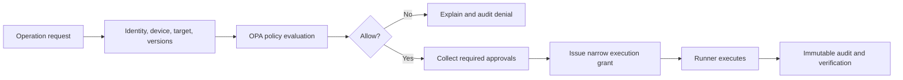

# Phase 13: Governance and Enterprise Readiness

## Outcome

Organizations can prove that sensitive operations were performed by authorized identities on approved targets, using reviewed versions and credentials, under deterministic policy, with complete and exportable evidence.

## Capability and release mapping

- Capability phase: 13
- Governance foundations begin in Phase 0; enterprise packaging follows the core product
- Marketed with later 1.x enterprise capabilities
- Policy engine: Open Policy Agent
- Primary owners: Go control plane, identity boundary, and audit pipeline

Security is not deferred to Phase 13. This phase productizes and scales controls that must exist from the beginning.

## Prerequisites

- Every earlier phase emits versioned identities, authorization decisions, and correlated audit events.
- Organizations, projects, environments, devices, runners, and service accounts are stable principals or resources.
- Secret use, approval, and execution are separable permissions.
- Audit storage has integrity, retention, and tenant isolation.

## Identity

- OIDC;
- OAuth for provider integrations;
- MFA for sensitive operations;
- registered and revocable devices;
- session management and reauthentication;
- service accounts and workload identities;
- SAML for enterprise demand;
- SCIM for lifecycle provisioning.

Identity assertions record issuer, subject, authentication context, session, device, and organization mapping. Sensitive actions can require recent MFA or device posture.

## Authorization

Authorization combines organization, project, and environment roles with resource and action conditions.

Initial permissions include:

- `logs:read`;
- `metrics:read`;
- `ssh:connect`;
- `credential:use`;
- `credential:export`;
- `action:execute`;
- `deployment:staging`;
- `deployment:production`;
- `configuration:write`;
- `secret:rotate`;
- `incident:resolve`.

Viewing credential metadata, using a credential through a runner, and exporting material are intentionally separate.

## Policy engine

Open Policy Agent evaluates deterministic rules such as:

- production deployment requires two eligible approvals;
- destructive commands are prohibited;
- production credentials cannot be exported;
- a database migration requires a verified backup;
- secrets must be below a maximum age;
- deployment is restricted to approved branches;
- customer-network execution requires an organization-hosted runner;
- AI proposals never satisfy a human approval requirement.

Policies are versioned, tested, reviewed, and promoted like code. A decision records policy version, inputs, outcome, reasons, and obligations.

## Audit

Each material event records:

- organization and project;
- user or service identity;
- device and session;
- action and target;
- structured command or operation;
- credential reference, never value;
- configuration, Action, and flow versions;
- approvals and policy decision;
- result and recovery state;
- event and ingestion timestamps;
- correlation ID and integrity metadata.

Audit views support search, timeline, evidence linking, export, retention, legal hold, and access logging. Events are append-only; corrections add linked events rather than rewriting history.

## Enterprise additions

- SCIM and SSO;
- signed audit export;
- organization retention policies;
- organization-hosted runners;
- IP allowlists and network zones;
- legal hold;
- region selection and data residency;
- compliance evidence reports;
- customer-managed keys where justified;
- break-glass access with additional review and monitoring.

Compliance reports describe implemented controls and evidence. They do not claim certification that has not been independently achieved.

## Tenant and regional architecture

- every data access is organization-scoped;
- high-value storage paths include tenant-bound encryption context;
- region selection is explicit and documented by data category;
- background jobs carry tenant identity;
- cache keys and telemetry attributes prevent cross-tenant collisions;
- support staff access is time-bound, approved, and audited;
- exports are encrypted and expire.

## Data and events

Phase 13 adds:

- `IdentityProvider`, `EnterpriseUser`, `ServiceAccount`, and `DevicePosture`;
- `Role`, `Permission`, `RoleBinding`, and `PolicyBundle`;
- `PolicyDecision`, `ExecutionObligation`, and `BreakGlassGrant`;
- `RetentionPolicy`, `LegalHold`, `AuditExport`, and `ComplianceEvidence`.

Important events:

- `identity.authentication.completed`;
- `device.revoked`;
- `policy.decision.recorded`;
- `authorization.denied`;
- `break_glass.requested`;
- `audit.export.created`;
- `retention.policy.changed`;
- `legal_hold.applied`.

## Work packages

1. Consolidate the resource/action authorization model used by all phases.
2. Implement OIDC, MFA context, session, device, and service-account controls.
3. Add role bindings and environment-specific permissions.
4. Integrate OPA with versioned policies, tests, explanations, and obligations.
5. Harden append-only audit ingestion, integrity, search, and export.
6. Add SAML and SCIM based on validated enterprise demand.
7. Implement retention, legal hold, IP rules, and region selection.
8. Build compliance evidence mapping and external assessment readiness.

## Quality strategy

- authorization matrix tests for roles, resources, environments, and actions;
- cross-tenant isolation and cache-key tests;
- policy unit tests and decision snapshots;
- stale identity, revoked device, expired MFA, and service-account scenarios;
- audit completeness, ordering, integrity, and export verification;
- retention and legal-hold conflict tests;
- break-glass drills;
- penetration testing and independent security review before enterprise claims.

## Exit gate

Phase 13 is complete when a production operation can be proven end to end: authenticated user and device, effective role, evaluated policy version, required approvals, immutable Action and flow versions, exact targets, credential reference, runner identity, result, recovery verification, and tamper-evident audit export. Unauthorized and cross-tenant attempts must fail and be recorded.

## Risks and controls

| Risk | Control |
| --- | --- |
| Roles become too coarse | Environment and resource conditions with separate sensitive permissions |
| Policy change silently weakens controls | Versioning, tests, review, staged promotion |
| Audit claims exceed integrity guarantees | Explicit threat model and independently verified controls |
| Enterprise scope overwhelms product | Additions follow validated customer and compliance needs |
| Break-glass becomes a bypass | Narrow duration, strong authentication, alerting, and review |

## Non-goals

- claiming certifications before assessment;
- implementing every identity standard before demand;
- making policy decisions through an LLM;
- allowing mutable audit history;
- granting support staff standing access to customer environments.

## Program completion

Phase 13 closes the initial capability roadmap. StackCendra should now demonstrate one coherent workflow:

> discover a project, run it locally, understand configuration, connect securely, automate delivery, trace a live failure to evidence, reproduce it safely, collaborate on remediation, and prove every sensitive decision.

Future phases should deepen this workflow or broaden integrations only when the addition preserves the same evidence, authorization, and audit standards.
