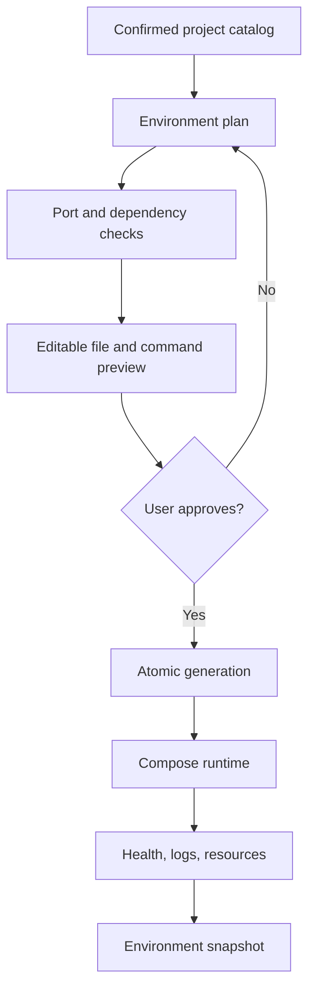

# Phase 2: Local Environment Manager

## Outcome

A developer can clone a supported project and run it locally without manually installing its service runtimes or databases. StackCendra generates an editable, Git-friendly environment proposal and manages its runtime lifecycle.

## Capability and release mapping

- Capability phase: 2
- First marketed in: release 0.2, with a constrained demonstration potentially included in 0.1
- Primary owners: Rust local agent and shared React interface
- Execution boundary: the user device and its local container runtime

## Prerequisites

- Phase 1 has produced a reviewed project and service graph.
- Docker Engine and Compose availability can be detected.
- File writes and process execution require separate, explicit capabilities.
- Generated artifacts carry provenance and can be previewed before application.

## User journey

1. Select a confirmed project snapshot.
2. Review proposed services, images, commands, ports, networks, and volumes.
3. Resolve missing inputs and port conflicts.
4. Preview the exact files and commands StackCendra will use.
5. Generate into an isolated StackCendra area or an approved repository path.
6. Start the environment and watch health, logs, and dependencies converge.
7. Open a service, inspect it, stop it, or restore a saved snapshot.

## Functional scope

### Environment generation

- Dockerfiles and `.dockerignore` files;
- `compose.yaml`;
- `.env.example` containing placeholders only;
- health checks;
- named volumes and isolated networks;
- development hot reload;
- inferred startup commands and dependency ordering;
- editable previews and minimal diffs;
- stable formatting suitable for version control.

### Runtime management

- start, stop, restart, and rebuild;
- per-service status and health;
- container log streaming;
- terminal access with explicit authorization;
- CPU, memory, network, and storage observations;
- volume and network inspection;
- dependency-graph state overlay;
- saved local environment snapshots.

### Port intelligence

- identify port conflicts before startup;
- identify the owning process where operating-system permissions allow;
- propose reuse, remapping, or stopping the conflicting process;
- update all affected generated references consistently;
- preserve project-specific mappings;
- open service URLs;
- optionally generate local reverse-proxy domains.

### Initial templates

- Next.js with PostgreSQL;
- NestJS with PostgreSQL and Redis;
- FastAPI with PostgreSQL;
- Django with PostgreSQL;
- Spring Boot with PostgreSQL;
- Go with PostgreSQL;
- MERN;
- mixed-service microservices fixture.

## Generation approach

Environment generation is a compiler pipeline:

1. normalize a confirmed project snapshot;
2. select and version a template strategy;
3. resolve variables, ports, health checks, and dependencies;
4. produce an intermediate environment plan;
5. validate the plan against policy and host capabilities;
6. render a deterministic file set;
7. show a semantic and textual diff;
8. apply approved writes atomically;
9. verify Compose configuration before runtime execution.

Generated files include a machine-readable provenance block or companion manifest. User-owned edits are detected and preserved; regeneration produces a three-way proposal rather than silently overwriting them.

## Runtime ownership and safety

- Docker access remains local through the Rust agent.
- Destructive operations name the exact project, service, volume, or image.
- Deleting persistent volumes is never implied by “stop” or “rebuild.”
- Image pulls and builds display network and disk consequences.
- Terminals are attached only after user intent and are fully auditable.
- Commands are built from structured arguments, not concatenated shell strings.

## Data and events

Phase 2 adds:

- `EnvironmentPlan`, `GeneratedArtifact`, and `GenerationRevision`;
- `LocalEnvironment`, `ServiceRuntime`, and `HealthObservation`;
- `PortAllocation`, `VolumeReference`, and `NetworkReference`;
- `EnvironmentSnapshot`.

Important events:

- `environment.plan.created`;
- `environment.files.approved`;
- `environment.started`;
- `service.health.changed`;
- `port.conflict.detected`;
- `environment.snapshot.created`;
- `environment.stopped`.

## Work packages

1. Define the environment-plan intermediate representation.
2. Implement deterministic templates and generation provenance.
3. Add preview, semantic diff, atomic write, and regeneration handling.
4. Implement Compose lifecycle and streaming observations.
5. Build port ownership, remapping, and URL resolution.
6. Add status, logs, terminal, resources, networks, and volumes views.
7. Implement snapshots and recovery guidance.
8. Validate all initial templates against clean-machine scenarios.

## Quality strategy

- golden tests for every rendered template;
- schema validation for environment plans;
- Compose configuration validation before execution;
- clean-machine end-to-end tests;
- conflict and user-edit preservation tests;
- startup-order and health-transition tests;
- failure injection for unavailable images, ports, and dependencies;
- Windows and Linux filesystem and networking tests;
- volume-preservation and destructive-action tests.

## Deliverables

- environment-plan schema;
- template and renderer library;
- preview and regeneration experience;
- local Compose runtime controller;
- port-resolution workflow;
- service status, logs, health, resource, network, and volume views;
- environment snapshot format;
- supported-template compatibility matrix.

## Exit gate

Phase 2 is complete when a fresh developer can clone each maintained fixture, approve a generated environment, resolve any detected port conflict, start it without installing service runtimes or databases directly, observe healthy services, open the application, stop it without data loss, and reproduce the result from committed generated files.

## Risks and controls

| Risk | Control |
| --- | --- |
| Generated files overwrite user work | Provenance, semantic diff, atomic writes, three-way regeneration |
| Docker privileges become overly broad | Narrow local API, exact target display, deny destructive defaults |
| Templates hide unsupported assumptions | Compatibility matrix and explicit unresolved inputs |
| Host-specific ports make environments unstable | Persisted project mappings and consistent reference updates |
| “Works on my machine” moves into Compose | Clean-machine CI fixtures and deterministic generation |

## Non-goals

- remote deployment;
- production orchestration;
- Kubernetes cluster operations;
- synchronizing real secrets;
- fully general Dockerfile synthesis for unknown stacks;
- deleting user data as part of routine lifecycle actions.

## Handoff to Phase 3

Phase 3 consumes the confirmed project model and generated runtime plan to discover configuration requirements, compare environments, and separate schemas and secret references from local literal values.
