# Phase 3: Configuration Intelligence

## Outcome

StackCendra identifies what configuration each service requires, expresses it as a versioned contract, compares environments, and blocks unsafe promotion before configuration drift becomes a production failure.

## Capability and release mapping

- Capability phase: 3
- Marketed across: releases 0.2 and 0.3
- Primary owners: Rust discovery, Go control plane, shared interface
- Commercial role: first strong team and deployment-safety module

Configuration discovery may begin locally, but comparison and approval require organization, project, and environment ownership.

## Prerequisites

- Phase 1 service boundaries and evidence model exist.
- Phase 2 provides generated environment artifacts and runtime observations.
- Secret references are distinct from secret values.
- Every environment has a stable identity and ownership policy.

## User journey

1. Scan code and infrastructure for configuration requirements.
2. Review inferred variables, types, constraints, consumers, and evidence.
3. Publish a versioned configuration contract.
4. Map contract variables to per-environment values or secret references.
5. Compare local, testing, staging, production, disaster recovery, or custom environments.
6. Resolve blocking differences through previewed, approved updates.
7. Calculate deployment readiness and attach the result to pull requests and promotions.

## Discovery scope

Initial source patterns include:

- `process.env.NAME`;
- `os.getenv("NAME")`;
- `@Value("${name}")`;
- `System.getenv("NAME")`;
- `os.Getenv("NAME")`;
- `std::getenv("NAME")`.

Infrastructure sources include Dockerfiles, Compose, Kubernetes, Helm, CI workflows, Terraform, and framework configuration. Parsers record declaration, default, use site, and evidence; they do not persist secret literals.

## Configuration contract

A variable may declare:

- canonical name and aliases;
- owning service and consumers;
- type, format, allowed values, and bounds;
- required or optional status;
- safe default;
- secret classification;
- validation strategy;
- lifecycle state and deprecation;
- documentation and evidence;
- environment applicability.

Contracts are immutable versions. Changes are classified as compatible, warning, or breaking. A new required variable without an environment mapping is breaking.

## Comparison and readiness

Supported environment categories:

- local;
- development;
- testing;
- staging;
- production;
- disaster recovery;
- user-created environments.

The comparison engine detects:

- missing required and unexpected extra values;
- type, format, range, and protocol mismatches;
- stale contract or configuration versions;
- expired secret metadata;
- insecure defaults;
- surprising environment differences;
- runtime values drifting from declared state;
- incompatible dependency versions.

Readiness is an explainable policy result, not an opaque AI score. It returns blockers, warnings, passed checks, evidence, and the evaluated versions.

## Synchronization model

```mermaid
flowchart LR
    Contract["Versioned contract"] --> Compare["Compare environments"]
    Compare --> Proposal["Change proposal"]
    Proposal --> Redact["Remove secret values"]
    Redact --> Policy["Policy and ownership checks"]
    Policy --> Approval["Required approvals"]
    Approval --> Apply["Atomic adapter update"]
    Apply --> Validate["Connectivity and runtime validation"]
    Validate --> Audit["Versioned audit result"]
```

Synchronization supports schemas, non-secret values, and secret placeholders. It does not copy production secrets by default. Every update has a preview, adapter-specific preflight, atomicity boundary, rollback plan, owner, and audit event.

## Pull-request control

The Git integration eventually evaluates contract impact:

1. diff configuration-use evidence against the base revision;
2. identify added, removed, renamed, or changed variables;
3. map affected services and target environments;
4. evaluate contract compatibility and coverage;
5. post a check containing evidence and remediation;
6. block only according to deterministic repository policy.

Phase 3 exposes this capability contract; Phase 7 provides the complete pull-request experience.

## Data and events

Phase 3 adds:

- `ConfigurationContract` and immutable `ConfigurationContractVersion`;
- `ConfigurationVariable` and `ConfigurationRequirement`;
- `EnvironmentConfigurationVersion`;
- `SecretReference` metadata;
- `ConfigurationDifference`, `ReadinessEvaluation`, and `SyncProposal`.

Important events:

- `configuration.requirement.discovered`;
- `configuration.contract.published`;
- `configuration.drift.detected`;
- `configuration.sync.requested`;
- `configuration.sync.approved`;
- `configuration.version.applied`;
- `deployment.readiness.evaluated`.

## Security and privacy

- Values are classified before storage or transport.
- Secret values never appear in diffs, ordinary logs, analytics, or AI prompts.
- Access checks distinguish viewing metadata, using a secret, and exporting a secret.
- Production synchronization requires explicit target, preview, policy validation, and approval.
- Adapters use narrow, short-lived credentials.
- Readiness evidence may state that a secret is missing or expired without revealing it.

## Work packages

1. Define configuration requirement and contract schemas.
2. Implement language and infrastructure extractors.
3. Build review, correction, and version-publishing workflows.
4. Implement environment mappings and comparison rules.
5. Add secret-reference adapters with metadata-only reads.
6. Build synchronization proposals, approval, atomic apply, and rollback.
7. Implement readiness evaluation and policy output.
8. Expose commit and pull-request impact contracts.

## Quality strategy

- parser fixtures for every supported language and framework;
- contract compatibility tests;
- property tests for type and format validation;
- pairwise and multi-environment comparison scenarios;
- secret canaries across logs, traces, UI, exports, and AI boundaries;
- adapter contract tests with failure and partial-write injection;
- atomicity and rollback tests;
- deterministic readiness-score snapshots.

## Deliverables

- configuration discovery engine;
- versioned contract editor and registry;
- environment comparison matrix;
- secret-reference abstraction;
- synchronization proposal and approval workflow;
- deployment readiness report;
- configuration impact API for Git checks.

## Exit gate

Phase 3 is complete when a pull request adding a required variable is detected, mapped to the correct service, shown with source evidence, evaluated against target environments, blocked by deterministic policy when production lacks a mapping, and resolved through an approved contract and placeholder update without exposing a secret value.

## Risks and controls

| Risk | Control |
| --- | --- |
| Variable-name heuristics misclassify secrets | Classification rules, review, and conservative redaction |
| Sync accidentally copies production secrets | Schema and placeholder sync by default; export denied |
| Readiness score appears arbitrary | Rule-level explanation, evidence, and versioned policy |
| Adapter partial failure creates drift | Preflight, atomic boundary, compensation, and verification |
| Code scanning misses dynamic access | Coverage reporting and explicit unknown state |

## Non-goals

- becoming a general-purpose secret manager;
- automatic production secret copying;
- opaque AI authorization;
- guaranteeing discovery of dynamically constructed names;
- replacing environment-specific infrastructure policy.

## Handoff to Phase 4

Remote hosts are now meaningful project and environment targets. Phase 4 introduces the secure device-side connection and credential foundation required to inspect and operate them.
