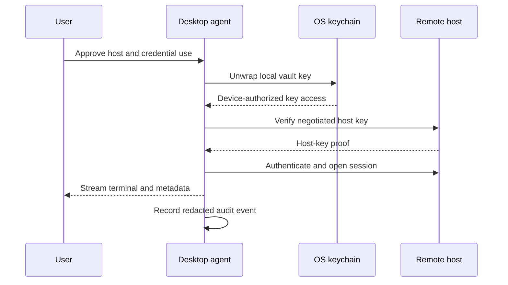

# Phase 4: Secure SSH Client and Keychain

## Outcome

A user can organize authorized hosts, create or import a key, install its public key, connect through a desktop terminal, transfer files, and create tunnels without exposing plaintext private keys to the StackCendra cloud.

## Capability and release mapping

- Capability phase: 4
- First marketed in: release 0.4
- Primary owner: Rust desktop agent
- Primary trust boundary: device-local vault
- Remote automation boundary: isolated authorized runner

## Prerequisites

- Device identity, revocation, audit envelopes, and capability authorization exist.
- Projects and environments can own host references.
- OS keychain integration is available on supported desktop platforms.
- Host-key verification is deny-by-default.

## User journey

1. Add a host or associate a discovered cloud resource.
2. verify hostname, port, user, environment, jump host, and expected host key.
3. Generate an Ed25519 key or import an existing supported key.
4. Protect it with the OS keychain and optional passphrase.
5. Install only the public key through an explicitly reviewed path.
6. Open a terminal, SFTP session, or saved tunnel.
7. Review connection history, health, and security reminders.

## Host management

- folders, environment groups, and tags;
- hostname, port, username, and authentication method;
- jump hosts and proxy chains;
- cloud-resource and project association;
- connection history and last verified host key;
- reachability and host-health observations;
- saved terminal, SFTP, and tunnel preferences.

Host metadata may synchronize. Credential material follows the selected security mode.

## Terminal and file operations

### Terminal

- tabs and split panes;
- reconnect with explicit session state;
- search, themes, snippets, and command history;
- synchronized input only after a visible warning;
- shell, encoding, and terminal capability configuration;
- session metadata and audit correlation.

### SFTP

- upload, download, rename, delete, and permissions;
- drag-and-drop and transfer queue;
- pause, resume, retry, and checksum verification;
- bounded remote preview;
- external editor integration using temporary, protected files.

### Port forwarding

- local forwarding;
- remote forwarding;
- dynamic SOCKS proxy;
- named tunnel profiles;
- connection and health monitoring;
- explicit bind-address warnings.

## Dual vault model

### Local-only vault

- private material is encrypted and decrypted on the device;
- the wrapping key is protected by the OS keychain;
- cloud storage receives ciphertext only if encrypted backup is enabled;
- the backend cannot initiate unattended sessions;
- export requires a separate high-risk permission and user presence.

### Automation vault

- credentials are encrypted using envelope encryption;
- decryption occurs only in an isolated, authorized runner;
- the control-plane API never returns plaintext;
- authorization is scoped to action version, targets, purpose, and time;
- every access creates an audit event;
- customer-hosted runners are preferred for production networks.

These modes are visibly distinct. Moving a credential from local-only to automation use is a deliberate, reviewed operation, not a checkbox side effect.

## Connection sequence

## Key lifecycle

- generate Ed25519 keys by default;
- import OpenSSH-compatible keys;
- offer RSA only for compatibility;
- display fingerprints and host mappings;
- support passphrase protection;
- track creation, use, rotation reminder, and revocation metadata;
- install and remove public keys through auditable actions;
- revoke device and synchronized ciphertext access independently.

## Security controls

- never store plaintext private keys;
- never log credentials, passphrases, typed secrets, or unredacted terminal output;
- do not silently accept changed host keys;
- protect memory lifetime and temporary files;
- isolate renderer processes from direct credential access;
- require explicit permissions for connect, use, export, install, and delete;
- rate-limit authentication attempts;
- prevent public bind addresses for tunnels unless separately authorized;
- redact known secret patterns before optional session capture.

## Work packages

1. Define host, credential-metadata, connection, and tunnel contracts.
2. Implement OS-keychain-backed local vault and recovery rules.
3. Add key generation, import, fingerprint, mapping, and rotation metadata.
4. Implement SSH transport, known-host verification, and jump hosts.
5. Build terminal sessions, tabs, panes, reconnect, and search.
6. Implement SFTP and protected external-editor workflow.
7. Add tunnel profiles and monitoring.
8. Design and test the separate automation-vault authorization path.

## Quality strategy

- cryptographic test vectors and storage migration tests;
- host-key mismatch and downgrade tests;
- protocol interoperability fixtures;
- memory and temporary-file exposure review;
- permission-boundary tests between UI and Rust commands;
- SFTP interruption and integrity tests;
- tunnel bind-address and lifecycle tests;
- device revocation and backup recovery drills;
- secret-canary checks over logs, traces, crashes, and audit artifacts.

## Deliverables

- host catalog;
- local encrypted keychain;
- key lifecycle interface;
- verified SSH terminal;
- SFTP transfer manager;
- saved, monitored port forwarding;
- automation-vault design and runner authorization contract;
- threat-model update and external security review checklist.

## Exit gate

Phase 4 is complete when a user can generate an Ed25519 key locally, install only the public key on an authorized VM, confirm the host key, establish a terminal session, transfer a file, and reopen the session while private material remains device-encrypted and absent from cloud APIs, logs, traces, and crash reports.

## Risks and controls

| Risk | Control |
| --- | --- |
| Cloud compromise exposes keys | Local-only encryption; ciphertext-only backup |
| Changed host is silently trusted | Strict known-host policy and explicit re-verification |
| Renderer compromise reaches credentials | Narrow Tauri commands and Rust-owned vault |
| Automation expands credential scope | Purpose-, target-, version-, and time-bound grants |
| Session capture leaks secrets | Capture off by default, redaction, retention controls |

## Non-goals

- unrestricted bastion management;
- server inventory across every cloud;
- autonomous remote execution;
- replacing enterprise privileged-access management;
- recording all terminal content by default;
- copying credentials through the ordinary clipboard.

## Handoff to Phase 5

Phase 5 builds repeatable Actions on the same host, credential-reference, authorization, redaction, and audit primitives. Interactive access does not automatically grant automation access.
