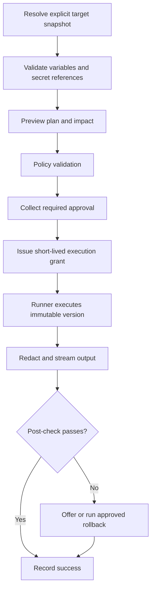

# Phase 5: Shortcuts, Snippets, and Actions

## Outcome

Users can turn repeated operational procedures into versioned, parameterized Actions and execute them against explicitly selected targets with previews, approvals, redacted streaming output, validation, rollback, and a complete audit record.

## Capability and release mapping

- Capability phase: 5
- First marketed in: release 0.5
- Primary owners: Rust desktop runner and Go control plane
- Sensitive execution: customer-controlled or narrowly authorized runner

Shortcuts and snippets improve interactive work. Actions are the durable, governable automation primitive consumed by later visual flows.

## Prerequisites

- Phase 4 host identity, credential references, secure transports, and audit controls exist.
- Project, environment, host group, and user authorization are stable.
- Commands can be represented as structured execution steps.
- Secret redaction is enforced at the runner before output leaves it.

## Interaction layers

### Shortcuts

Initial defaults include:

| Intent | Suggested binding |
| --- | --- |
| Open command palette | `Ctrl+Shift+P` |
| New SSH session | `Ctrl+Shift+T` |
| Open keychain | `Ctrl+Shift+K` |
| Open logs | `Ctrl+Shift+L` |
| Insert selected credential | `Ctrl+Shift+V` |
| Run health check | `Ctrl+Alt+H` |
| Restart selected service | `Ctrl+Shift+R` |
| Explain terminal failure | `Ctrl+Shift+A` |

Bindings are configurable and conflict-aware. Credentials are injected into the terminal input stream through an authorized path and are never placed on the ordinary clipboard.

### Command snippets

The initial library covers Docker status, disk and memory usage, process inspection, system-service state, log tails, Nginx validation, certificate expiry, PostgreSQL health, and Kubernetes pod status.

Snippets are editable command drafts. They do not gain target selection, credentials, or unattended execution until promoted to an Action.

### Actions

An immutable Action version defines:

- target selector;
- structured commands or typed operations;
- secret references and variables;
- input and output files;
- preconditions and conditions;
- retry strategy and timeout;
- output parser and redaction rules;
- post-execution validation;
- rollback or compensation;
- approval and permission requirements.

## Execution lifecycle

Target selectors resolve to an immutable target snapshot before approval. A late change in membership invalidates the grant or requires reapproval.

## Initial Action library

- deploy an application;
- install Docker;
- configure a reverse proxy;
- restart a service;
- run database migrations;
- create and restore database backups;
- rotate an SSH key;
- collect diagnostics;
- renew a certificate;
- clean Docker resources;
- patch an operating system;
- roll back a release.

Library entries are examples and templates, not universally safe commands. Each declares supported operating systems, prerequisites, permissions, validation, and rollback limitations.

## Authorization model

The control plane may coordinate an Action, but only a runner with a valid, narrow grant executes it. A grant binds:

- organization, project, and environment;
- immutable Action version;
- exact target snapshot;
- initiating user and required approvers;
- permitted secret references;
- expiration and single-use identifier;
- policy decision and correlation ID.

AI may generate a draft or explain failure. It cannot approve the Action, broaden the target, select a credential, or bypass policy.

## Output and artifacts

- stdout and stderr are segmented, timestamped, and attributed to steps and targets;
- redaction occurs before network transmission;
- parsers produce typed results while retaining bounded raw evidence;
- large artifacts use encrypted object storage with retention rules;
- secret canaries fail the execution pipeline if they cross the redaction boundary;
- users can download sanitized diagnostic bundles.

## Failure and rollback

An Action declares whether it is read-only, idempotent, reversible, compensatable, or irreversible. Retry is allowed only for steps whose semantics support it.

Rollback is never implied to be safe. The preview explains:

- what state is captured;
- which steps can be reversed;
- what data could be lost;
- whether approval is required;
- what manual recovery remains.

## Data and events

Phase 5 adds:

- `Action`, immutable `ActionVersion`, and `ActionRun`;
- `TargetSelector`, `TargetSnapshot`, and `ExecutionGrant`;
- `ActionStepRun`, `RedactedOutputSegment`, and `ActionArtifact`;
- `ValidationResult`, `RollbackPlan`, and `Approval`.

Important events:

- `action.version.published`;
- `action.execution.requested`;
- `action.approval.requested`;
- `action.execution.started`;
- `action.step.completed`;
- `action.validation.failed`;
- `action.rollback.completed`;
- `action.execution.completed`.

## Work packages

1. Define the Action schema and versioning rules.
2. Implement target resolution and immutable snapshots.
3. Build variable, file, and secret-reference input handling.
4. Add preview, policy, approval, and execution grants.
5. Implement runner protocol, streaming, redaction, and cancellation.
6. Add validation, idempotency, retries, and rollback semantics.
7. Build shortcuts, snippets, and the initial Action library.
8. Add history, artifacts, audit views, and sanitized exports.

## Quality strategy

- schema compatibility and signature tests;
- authorization tests for every grant field;
- target-membership race tests;
- redaction tests with generated secret canaries and split-token output;
- timeout, disconnect, cancellation, and retry fault injection;
- idempotency and partial-execution scenarios;
- approval-expiry and revocation tests;
- library Action tests on disposable fixtures;
- rollback drills that verify both success and stated limitations.

## Exit gate

Phase 5 is complete when a user can define and publish an Action, select a VM group, review the resolved targets and commands, receive required approval, execute through an authorized runner, see live redacted logs, validate the outcome, and inspect a correlated audit record. Changing the Action or targets after approval must invalidate execution.

## Risks and controls

| Risk | Control |
| --- | --- |
| Broad selector affects unintended hosts | Resolve and approve an immutable target snapshot |
| Output leaks credentials | Runner-side redaction and secret-canary tests |
| Retry repeats a destructive step | Explicit idempotency and retry declarations |
| Rollback promise is misleading | Capability classification and documented recovery limits |
| AI-generated command gains authority | Draft-only AI boundary and deterministic policy |

## Non-goals

- unattended arbitrary shell access from the SaaS backend;
- automatic execution of AI suggestions;
- guaranteeing rollback for irreversible operations;
- replacing full configuration-management platforms in this phase;
- hidden global shortcut capture.

## Handoff to Phase 6

Phase 6 composes immutable Action versions and typed operational nodes into durable workflows. Actions remain independently executable and auditable.
