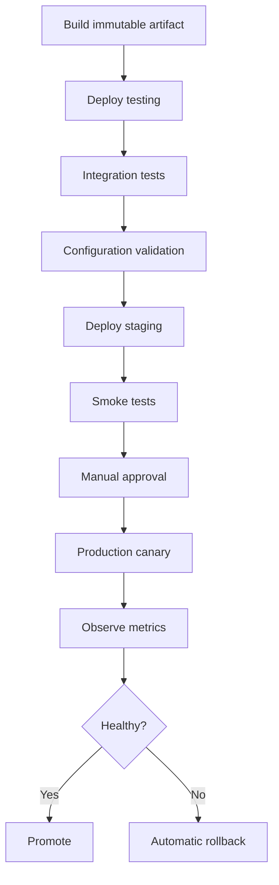

# Phase 6: Visual Automation Flows

## Outcome

Users can design, approve, execute, observe, pause, resume, and audit durable delivery and operations workflows with dependencies, parallelism, health gates, deployment strategies, and automatic rollback.

## Capability and release mapping

- Capability phase: 6
- First marketed in: release 0.6
- Editor: React Flow
- Durable execution: Temporal
- Execution locations: desktop, organization runner, ephemeral hosted runner, private-network runner, or Kubernetes runner

## Prerequisites

- Phase 5 provides immutable, permission-aware Actions.
- Runner identity, grants, redaction, and artifacts are production-shaped.
- Environments, configuration readiness, approvals, and health evidence have stable contracts.
- Workflow history can survive application and worker restarts.

## Node model

Initial node types:

- Action;
- SSH command;
- script;
- Docker operation;
- Kubernetes operation;
- HTTP request;
- condition;
- parallel branch;
- approval;
- timer;
- health check;
- notification;
- AI analysis;
- rollback;
- artifact promotion.

Every node declares typed inputs and outputs, retry and timeout behavior, required capabilities, eligible runner types, secret references, cancellation behavior, and compensation support.

## Authoring process

1. Create a draft flow from an empty canvas or template.
2. Add typed nodes and connect compatible outputs and inputs.
3. Configure environments, variables, policies, and runner placement.
4. Validate reachability, cycles, missing rollback, and unsafe permissions.
5. Simulate the flow using fixtures or a non-production environment.
6. Publish an immutable version.
7. Request execution against an explicit environment and artifact.

React Flow owns the visual model and editing experience. The canonical workflow definition is a versioned, UI-independent schema compiled to Temporal workflows and activities.

## Execution behavior

- sequential and parallel stages;
- dependencies and conditional branches;
- retries with backoff and idempotency constraints;
- manual approvals;
- schedules and timers;
- health and configuration gates;
- canary, rolling, and blue-green deployment;
- environment and artifact promotion;
- failure paths and automatic rollback;
- immutable flow and Action versions.

## Durable execution approach

Temporal holds orchestration state, timers, retries, signals, and recovery. Activity workers perform bounded external effects. Workflow code must be deterministic, and version migration is planned before changing active definitions.

StackCendra stores the product-facing flow definition and maps it to:

- immutable workflow and node versions;
- Temporal workflow and activity identifiers;
- correlation and audit identifiers;
- runner assignments and grants;
- evidence and artifacts;
- approval and health-gate signals.

## Runner topology

Supported placements:

- local desktop runner for local and development operations;
- organization-hosted runner;
- cloud-hosted ephemeral runner;
- runner inside a private network;
- Kubernetes runner.

Production defaults to a customer-controlled runner with an outbound authenticated control-plane connection. The SaaS backend does not require inbound access to production SSH or long-lived production credentials.

Runner selection considers network reachability, data classification, capability set, environment policy, locality, concurrency, and health. Reassignment never broadens authorization.

## Approval and change control

Approval is bound to:

- immutable flow and Action versions;
- artifact digest;
- source and target environments;
- resolved targets;
- configuration versions;
- policy result;
- deployment strategy and rollback plan.

Any material change invalidates the approval. Approvers see evidence and impact, not only a generic confirmation dialog.

## Data and events

Phase 6 adds:

- `Flow`, immutable `FlowVersion`, and `FlowNodeVersion`;
- `FlowRun`, `StageRun`, and `NodeRun`;
- `RunnerAssignment`, `HealthGate`, and `Promotion`;
- `ArtifactReference`, `Schedule`, and `WorkflowSignal`.

Important events:

- `flow.version.published`;
- `flow.run.requested`;
- `flow.stage.started`;
- `flow.approval.requested`;
- `flow.health_gate.failed`;
- `deployment.promoted`;
- `flow.rollback.started`;
- `flow.run.completed`.

## Work packages

1. Define the UI-independent flow schema and validator.
2. Build the React Flow editor, typed ports, templates, and diff view.
3. Implement publish, immutable versions, and compatibility rules.
4. Establish Temporal server, workers, workflows, activities, and versioning policy.
5. Add runner matching and narrow execution grants.
6. Implement approvals, signals, schedules, and health gates.
7. Add canary, rolling, blue-green, promotion, and rollback templates.
8. Build execution timeline, replay, artifacts, and failure investigation.

## Quality strategy

- graph validation and schema property tests;
- deterministic workflow replay tests;
- worker crash, network partition, duplicate signal, and retry injection;
- approval mutation and expiration tests;
- runner loss and reassignment scenarios;
- health-gate false-positive and delayed-metric cases;
- strategy tests on disposable environments;
- rollback and partial-promotion drills;
- long-running workflow upgrade compatibility tests.

## Exit gate

Phase 6 is complete when a test-to-staging-to-production-canary flow executes from an immutable version, pauses for approval, deploys through an authorized runner, evaluates health evidence, rolls back automatically on injected failure, survives worker restart, and preserves a complete correlated timeline.

## Risks and controls

| Risk | Control |
| --- | --- |
| Visual graph diverges from execution | Canonical versioned schema compiled to Temporal |
| Workflow upgrade breaks active runs | Determinism tests and explicit version migration |
| Runner placement leaks access | Capability- and network-aware matching with narrow grants |
| Health gate reacts to noisy metrics | Windows, minimum samples, baselines, and human override policy |
| Approval covers changed inputs | Bind approval to all immutable versions and digests |

## Non-goals

- replacing every CI system;
- arbitrary untyped visual programming;
- direct LLM control of execution;
- public inbound connectivity to customer runners;
- pretending every external operation is transactionally reversible.

## Handoff to Phase 7

Phase 7 connects each flow run, artifact, configuration version, and deployment to its Git history and reviewed pull request.
