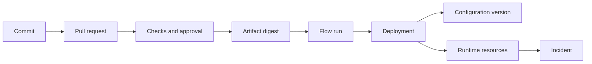

# Phase 7: Git Intelligence and Delivery

## Outcome

StackCendra explains how a proposed or deployed code change affects services, configuration, tests, risk, artifacts, and incidents, while preserving the source provider as the system of record.

## Capability and release mapping

- Capability phase: 7
- First marketed in: release 0.7
- Provider order: GitHub, GitLab, then Bitbucket
- Principle: integrate with Git hosting; do not build a new Git hosting system

## Prerequisites

- Phase 1 maps repositories, services, and evidence.
- Phase 3 exposes configuration-impact analysis.
- Phases 5 and 6 provide versioned Actions, flows, artifacts, and deployments.
- Provider installations use least-privilege authorization and verified webhooks.

## User journey

1. Connect a repository through a provider installation.
2. Open a pull request inside StackCendra.
3. Review commits, diffs, services, configuration changes, tests, and risk.
4. Resolve required checks and approvals in the source provider.
5. Promote the reviewed commit through a flow.
6. Trace any deployment or incident back to commit, pull request, reviewers, artifact, and configuration.

## Git experience

- repository browser;
- branch graph and commit history;
- expandable diffs and blame;
- worktree management;
- branch comparison;
- cherry-pick and rebase preview;
- conflict visualization;
- commit search;
- contributor analytics.

Mutating Git operations begin with a command preview and repository-state check. The local Git repository remains canonical for local operations; GitHub, GitLab, or Bitbucket remains canonical for hosted review state.

## Change-impact engine

The engine combines:

- changed paths and symbols;
- Phase 1 repository-to-service ownership;
- dependency graph traversal;
- configuration-use changes from Phase 3;
- build and test ownership;
- infrastructure and workflow changes;
- previous deployments and related incidents.

It produces evidence-backed affected and possibly affected sets. Uncertain ownership is visible; it is not silently converted into certainty.

## AI Git intelligence

AI may draft:

- commit messages;
- pull-request summaries;
- risk explanations;
- likely reviewer suggestions;
- missing-test suggestions;
- configuration-impact summaries;
- related-incident links.

Deterministic checks establish facts. AI output is labeled, cited to repository evidence, editable, and never grants approval.

## Code review

- inline comments and collaborative diff review;
- requested changes and approval state;
- provider-synchronized discussions;
- AI review suggestions;
- security and configuration checks;
- missing-test signals;
- protected-branch and required-check visibility.

Provider identifiers and webhook delivery IDs are stored so processing is idempotent and state can be reconciled.

## Delivery traceability

Every production deployment must answer:

- which commit and pull request;
- who reviewed and approved it;
- which artifact digest;
- which immutable flow and Action versions;
- which configuration version;
- which targets and runtime versions;
- what policy and health evidence allowed promotion.

## Data and events

Phase 7 adds:

- `ProviderInstallation`, `RepositoryConnection`, and `WebhookDelivery`;
- `Branch`, `Commit`, `PullRequest`, `Review`, and `CheckResult`;
- `ChangeImpact`, `AffectedService`, and `ReviewerSuggestion`;
- `ArtifactBuild` and deployment-to-source relationships.

Important events:

- `repository.synchronized`;
- `pull_request.updated`;
- `change_impact.calculated`;
- `configuration.impact.detected`;
- `review.approved`;
- `artifact.built`;
- `deployment.source.linked`.

## Security and privacy

- Prefer provider apps and short-lived installation tokens.
- Request only required repository scopes.
- Verify webhook signatures and deduplicate deliveries.
- Do not place private source diffs in external AI prompts without an explicit provider and data policy.
- Sanitize patches, logs, and comments for credentials.
- Treat forked pull requests as untrusted input.
- Never execute code merely to analyze a pull request.

## Work packages

1. Define provider-neutral repository, pull-request, review, and check contracts.
2. Implement GitHub App installation, token, webhook, and reconciliation flows.
3. Build repository, graph, history, diff, and worktree interfaces.
4. Implement service and configuration change-impact analysis.
5. Add review synchronization, checks, and provider deep links.
6. Associate artifacts, flows, deployments, and configuration versions.
7. Add evidence-linked AI drafting and suggestions.
8. Create GitLab adapter contracts and Bitbucket compatibility plan.

## Quality strategy

- provider contract tests and webhook replay fixtures;
- signature, replay, permission, and token-expiration tests;
- large-diff and rename impact fixtures;
- monorepo ownership and dependency traversal tests;
- fork and malicious-patch scenarios;
- provider reconciliation after missed events;
- Git worktree and dirty-state safety tests;
- evidence-link accuracy evaluation for AI suggestions.

## Exit gate

Phase 7 is complete when a GitHub pull request appears in StackCendra, the system identifies affected services and a newly required configuration value with source evidence, required checks remain synchronized with GitHub, and a deployment can be traced to the reviewed commit, artifact, configuration version, approvers, and flow run.

## Risks and controls

| Risk | Control |
| --- | --- |
| Provider state and local state diverge | Webhooks plus periodic reconciliation |
| Impact analysis overstates certainty | Affected/possible sets with evidence and confidence |
| Private code leaks to AI | Explicit provider policy, minimization, local option |
| StackCendra becomes another Git host | Provider remains system of record |
| Mutating Git action damages work | Preview, clean-state checks, and recoverable operations |

## Non-goals

- hosting Git repositories;
- replacing provider branch protection;
- autonomous merging;
- using AI review as an approval;
- promising complete semantic impact analysis for every language.

## Handoff to Phase 8

Phase 8 uses source, artifact, deployment, and configuration links to explain live Docker and Kubernetes resources.
