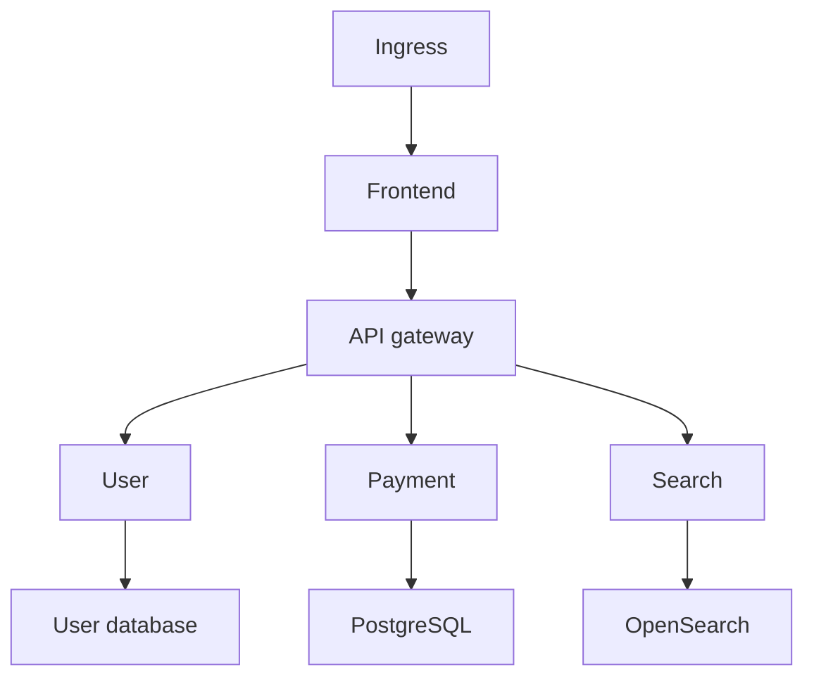

# Phase 8: Docker and Kubernetes Operations

## Outcome

Users can inspect Docker and Kubernetes topology, health, versions, configuration drift, logs, events, and resource use, then trace a failing request from ingress to workload, image, deployment, and Git commit.

## Capability and release mapping

- Capability phase: 8
- First marketed in: release 0.8
- Primary owners: Rust local agent and Go control plane
- Access path: local connection or authorized customer-network runner

## Prerequisites

- Phase 2 provides local Docker lifecycle and service modeling.
- Phases 6 and 7 connect deployments, artifacts, and source.
- Cluster and Docker credentials are references with environment-scoped authorization.
- Read-only inventory is distinct from operational mutations.

## Docker scope

- hosts and connection contexts;
- containers and Compose projects;
- images and vulnerability results;
- networks and volumes;
- logs, stats, and health;
- restart and rebuild with explicit target previews;
- service topology;
- deployment, configuration, and source associations.

## Kubernetes scope

- clusters and contexts;
- namespaces;
- deployments, StatefulSets, DaemonSets, and ReplicaSets as required by traced ownership;
- pods, containers, services, and ingress;
- ConfigMaps and Secret metadata only;
- Jobs and CronJobs;
- logs and events;
- requests, limits, and resource usage;
- rollout status and history;
- rollback and port forwarding;
- Helm release association.

Secrets display identifiers, versions, ownership, and age—not values.

## Topology model

Each node can overlay health, latency, error rate, resource use, version, last deployment, configuration drift, and selected time range. Every edge states whether it comes from declared configuration, runtime traffic, service discovery, or inference.

## Collection approach

Collectors produce normalized resource snapshots while preserving provider-specific fields. Watches and event streams feed incremental updates; periodic reconciliation repairs missed state.

Access is layered:

1. inventory and metadata;
2. logs and events;
3. port forwarding and exec;
4. restart, rebuild, rollout, and rollback.

Each layer has separate permissions. High-impact operations pass through Actions or flows rather than bypassing their approval and audit model.

## Failure investigation

The resource page connects:

- request trace and service;
- Kubernetes service and ingress;
- pod and container;
- image digest and vulnerability state;
- rollout and deployment event;
- configuration version and drift;
- flow run, artifact, commit, and pull request.

Unknown or ambiguous associations stay visible as unresolved graph edges.

## Data and events

Phase 8 adds:

- `ContainerHost`, `Container`, `Image`, `Network`, and `Volume`;
- `Cluster`, `Namespace`, and normalized `Workload`;
- `Pod`, `RuntimeContainer`, `ServiceEndpoint`, and `IngressRoute`;
- `Rollout`, `RuntimeSnapshot`, and `TopologyObservation`.

Important events:

- `container.health.changed`;
- `image.vulnerability.updated`;
- `cluster.resource.observed`;
- `workload.rollout.started`;
- `workload.rollout.failed`;
- `runtime.configuration_drift.detected`;
- `runtime.topology.updated`.

## Security and safety

- default to metadata-only read access;
- never retrieve Kubernetes Secret values during topology collection;
- use namespace and environment scopes;
- show exact targets and disruption budgets before mutations;
- prefer outbound customer runner connectivity for protected clusters;
- redact logs before transmission and enforce retention;
- protect kubeconfig and Docker credentials through vault references;
- record impersonated identity and authorization decision.

## Work packages

1. Define normalized container and Kubernetes resource contracts.
2. Extend local Docker observations beyond Phase 2.
3. Implement cluster connection, discovery, watches, and reconciliation.
4. Build deployment and ownership graph resolution.
5. Add topology overlays and time-aware inspection.
6. Associate image digest, configuration, flow, and Git history.
7. Route constrained mutations through Actions and approvals.
8. Add Helm release, vulnerability, and drift integrations.

## Quality strategy

- Docker and Kubernetes API contract fixtures;
- watch disconnect and missed-event reconciliation tests;
- namespace and permission boundary tests;
- graph ownership fixtures for Deployments, Jobs, and Helm;
- log redaction and retention tests;
- rollout, rollback, and disruption fault injection;
- large-cluster pagination and performance tests;
- kind or equivalent disposable-cluster end-to-end scenarios.

## Exit gate

Phase 8 is complete when a user can select a failing ingress request and trace it through service, pod, container image, rollout, configuration version, flow run, and Git commit, while Secret values remain inaccessible and any operational change uses a separately authorized, audited Action.

## Risks and controls

| Risk | Control |
| --- | --- |
| Resource graph becomes stale | Watches plus reconciliation and observation timestamps |
| Read access accidentally includes secrets | Metadata-only models and dedicated permission tests |
| Operations bypass workflow safety | Mutations route through Actions or flows |
| Large clusters overwhelm UI or storage | Scoped discovery, pagination, aggregation, retention |
| Topology implies uncertain links are factual | Edge provenance and confidence display |

## Non-goals

- replacing native Kubernetes administration tools;
- unrestricted `kubectl exec`;
- retrieving secret values for visualization;
- full vulnerability-management remediation;
- cross-cloud inventory, which begins in Phase 9.

## Handoff to Phase 9

Phase 9 links local and Kubernetes runtime entities to cloud compute, managed services, telemetry, identities, and secret metadata while retaining provider-specific capability.
