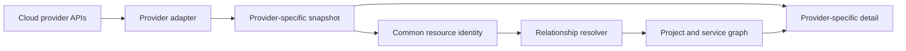

# Phase 9: Multi-Cloud Support

## Outcome

StackCendra relates services across local Docker, Kubernetes, and cloud resources while using narrow provider identities and retaining provider-specific behavior instead of flattening every cloud into an inaccurate common denominator.

## Capability and release mapping

- Capability phase: 9
- Initial provider work may support releases 0.8–1.0; broader coverage is marketed in release 1.2
- Provider order: AWS, GCP, then Azure
- Primary owner: Go control plane
- Protected-network access: organization-controlled runner

Capability phase and public release are intentionally separate here: AWS depth supports incident workflows before “multi-cloud” is marketed as complete.

## Prerequisites

- Phase 8 has a normalized runtime-resource and topology model.
- Projects, environments, services, deployments, and cloud-resource relationships are stable.
- Credential references support role assumption, workload identity, and short-lived tokens.
- Provider synchronization is observable and reconciled.

## Provider scope

### AWS first

- EC2;
- ECS and EKS;
- CloudWatch;
- RDS;
- Secrets Manager and Systems Manager Parameter Store metadata;
- IAM role assumption;
- Lambda;
- load balancers;
- deployment events.

### GCP second

- Compute Engine;
- GKE and Cloud Run;
- Cloud Logging and Cloud Monitoring;
- Secret Manager metadata;
- Cloud SQL;
- IAM service accounts and workload identity.

### Azure third

- Virtual Machines;
- AKS and Container Apps;
- Azure Monitor and Log Analytics;
- Key Vault metadata;
- Azure Database services;
- managed identities.

## Provider abstraction

The common contract covers capabilities such as:

- list compute and managed runtime resources;
- list clusters;
- query logs and metrics;
- resolve secret metadata or an authorized secret reference;
- request constrained resource operations;
- describe permissions, regions, accounts, and identities.

Each adapter also exposes typed provider-specific capabilities. Unsupported features return explicit capability results; they are not emulated or hidden behind a misleading universal model.

## Connection workflow

1. Choose provider, account, subscription, or project.
2. Select a documented least-privilege onboarding method.
3. Validate identity and enumerate effective permissions.
4. Choose regions and resource categories.
5. Preview discovered metadata before associating it with a StackCendra project.
6. Resolve relationships to environments, services, clusters, and deployments.
7. Continuously reconcile inventory and selected telemetry.

## Identity and credential strategy

- Prefer workload identity, managed identity, and role assumption.
- Avoid long-lived access keys.
- Request read-only inventory first and separate operational roles later.
- Bind tokens to organization, provider account, environment, and runner.
- Display effective permissions and inaccessible resource categories.
- Rotate and revoke provider connections independently.
- Use customer-hosted runners for private endpoints and restricted networks.

Cloud secret integrations expose references, version metadata, age, and policy state. Secret values are resolved only by an authorized runner for an approved execution.

## Resource relationships

Relationship rules use:

- account, region, project, subscription, and cluster identity;
- tags and labels;
- Kubernetes cloud-provider metadata;
- image digests and deployment identifiers;
- load-balancer target groups and service endpoints;
- infrastructure-as-code evidence;
- OpenTelemetry resource attributes;
- user-confirmed corrections.

Ambiguous relationships remain proposals with evidence and confidence.

## Data and events

Phase 9 adds:

- `CloudConnection`, `CloudIdentity`, and `EffectivePermission`;
- provider-specific `CloudResourceSnapshot`;
- normalized `CloudResource` and `CloudCapability`;
- `CloudResourceRelationship` and `SyncCursor`;
- `ProviderOperationRequest`.

Important events:

- `cloud.connection.verified`;
- `cloud.resource.discovered`;
- `cloud.permission.changed`;
- `cloud.relationship.proposed`;
- `cloud.relationship.confirmed`;
- `cloud.inventory.reconciled`;
- `cloud.operation.requested`.

## Work packages

1. Define provider capability, identity, inventory, and pagination contracts.
2. Implement AWS onboarding and least-privilege validation.
3. Add AWS compute, container, database, secret-metadata, and telemetry adapters.
4. Build resource relationship resolution and correction workflows.
5. Route constrained cloud operations through Actions and policies.
6. Harden reconciliation, quotas, backoff, and cost visibility.
7. Implement GCP adapters using the validated contracts.
8. Implement Azure adapters and publish a cross-provider capability matrix.

## Quality strategy

- provider SDK contract and pagination fixtures;
- permission-denied, expired-token, rate-limit, and regional-failure injection;
- read-only versus operational-role boundary tests;
- inventory reconciliation and deletion/tombstone tests;
- relationship-resolution golden scenarios;
- account and tenant isolation tests;
- cost and query-budget guards;
- sandbox-account integration tests for each supported provider.

## Deliverables

- provider SDK and capability registry;
- AWS connection and resource adapters;
- unified service-to-cloud graph;
- provider-specific detail views;
- effective-permission and synchronization health pages;
- customer-runner access pattern;
- GCP and Azure adapter roadmap and compatibility matrix.

## Exit gate

The AWS depth milestone is complete when StackCendra connects a local Docker service, its AWS deployment, and its Kubernetes workload as evidence-backed related entities using least-privilege identity. Phase 9 is fully complete when equivalent supported workflows exist across AWS, GCP, and Azure with explicit provider capability differences.

## Risks and controls

| Risk | Control |
| --- | --- |
| Common model hides critical differences | Common core plus typed provider extensions |
| Cloud permissions are overly broad | Read-only onboarding, effective-permission checks, separate roles |
| API costs and quotas grow unexpectedly | Scoped sync, caching, budgets, and backoff |
| Cross-account data leaks | Tenant-bound credentials, storage keys, and authorization tests |
| Resource links are wrong | Evidence, confidence, correction, and reconciliation |

## Non-goals

- feature parity across all providers on day one;
- becoming a cloud provisioning replacement;
- storing unrestricted long-lived cloud keys;
- retrieving secret values during inventory;
- abstracting away provider-specific security and operational behavior.

## Handoff to Phase 10

Phase 10 consumes the cross-environment resource graph, telemetry adapters, deployment events, configuration versions, and Git relationships to create evidence-driven incidents.
