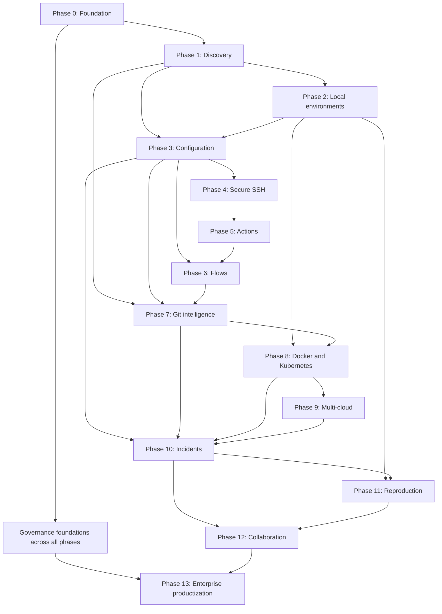

# Phase Delivery Framework

## Purpose

This page explains how StackCendra moves from one capability phase to the next without treating the roadmap as a list of unrelated features.

A **capability phase** is an engineering dependency boundary. A **public release** is a useful product package. They are related, but a release may contain a constrained part of more than one phase, and one phase may mature across several releases.

## Delivery principles

1. Complete one end-to-end user outcome before broadening integrations.
2. Use deterministic evidence before AI interpretation.
3. Separate viewing, proposing, approving, and executing.
4. Keep sensitive execution on the device or an authorized runner.
5. Version contracts, configuration, Actions, flows, policies, and evidence.
6. Make every phase produce an independently demonstrable artifact.
7. Preserve provenance so later phases can trust earlier facts.
8. Add enterprise controls continuously; productize them in Phase 13.

## Capability dependency map

The diagram shows hard capability dependencies, not a rule that all work is strictly sequential. Security, data contracts, testing, accessibility, telemetry, and developer experience continue through every phase.

## Phase and release traceability

| Phase | Capability | Likely public package | Required proof |
| --- | --- | --- | --- |
| 0 | Foundation and architecture | Pre-release | Reproducible, secure, observable foundation |
| 1 | Intelligent project discovery | 0.1 | Evidence-backed mixed-language service graph |
| 2 | Local environment manager | 0.2; constrained demo may enter 0.1 | Clean clone runs through generated environment |
| 3 | Configuration intelligence | 0.2–0.3 | Required variable is detected and blocks unsafe promotion |
| 4 | Secure SSH and keychain | 0.4 | Local key opens a verified remote session without cloud exposure |
| 5 | Actions | 0.5 | Approved operation runs with redacted logs and audit |
| 6 | Visual automation flows | 0.6 | Canary failure triggers durable rollback |
| 7 | Git intelligence and delivery | 0.7 | Deployment traces to reviewed source and configuration |
| 8 | Docker and Kubernetes operations | 0.8 | Request traces to workload, image, deployment, and commit |
| 9 | Multi-cloud support | AWS depth before 1.0; broader 1.2 | Related local, Kubernetes, and cloud entities |
| 10 | Observability and incident intelligence | 0.9 | Evidence-linked cross-domain root-cause hypothesis |
| 11 | Production-to-local reproduction | 1.0 | Safe local recreation and verified regression test |
| 12 | Real-time collaboration | 1.1 | Shared investigation and authorized remediation |
| 13 | Governance and enterprise readiness | Later 1.x | Policy-compliant, tamper-evident operation proof |

Public release labels remain proposals until release planning freezes scope. The phase exit gates are the durable engineering contract.

## Standard phase lifecycle

### 1. Frame

- confirm the user outcome and non-goals;
- identify hard dependencies and reused contracts;
- define the demonstration and measurable exit gate;
- record unresolved product or architecture decisions.

### 2. Design

- model the user workflow and failure paths;
- define ownership across web, desktop, agent, services, and runners;
- update data, API, event, and authorization contracts;
- perform threat, privacy, and operational reviews;
- specify migration and rollback.

### 3. Build vertically

- implement the smallest complete path through interface, contracts, runtime, persistence, telemetry, and audit;
- validate it against maintained fixtures;
- avoid scaffolding unrelated integrations;
- expose unknown and unsupported states honestly.

### 4. Harden

- test failure, cancellation, retry, recovery, and partial completion;
- validate tenant and trust boundaries;
- run performance and cost budgets;
- verify accessibility and supported platforms;
- update runbooks and known limitations.

### 5. Demonstrate and release

- execute the phase's proof scenario;
- retain evidence and benchmark results;
- reconcile Wiki claims with implemented behavior;
- freeze supported contracts and publish release notes;
- complete the handoff contract for the next phase.

## Required specification sections

Every phase page must define:

- outcome;
- capability and release mapping;
- prerequisites;
- user journey or operating process;
- functional scope;
- architecture and ownership;
- data and events;
- security and privacy;
- work packages;
- quality strategy;
- deliverables;
- exit gate;
- risks and controls;
- non-goals;
- downstream handoff.

Missing sections are treated as planning debt.

## Cross-cutting workstreams

| Workstream | Required in every phase |
| --- | --- |
| Security | Threat update, permissions, secret treatment, abuse tests |
| Data | Contract versioning, migration, retention, tenant scope |
| Observability | Correlation, structured signals, safe attributes, runbook |
| Quality | Unit, contract, integration, end-to-end, and failure tests |
| UX | Loading, empty, uncertain, failure, cancellation, and recovery states |
| Accessibility | Keyboard, focus, contrast, assistive semantics |
| Documentation | User workflow, operations, limitations, and decision updates |
| Delivery | Reproducible build, CI gates, artifacts, rollback |
| Portfolio proof | Scripted scenario, architecture explanation, measurable result |

## Change control

A phase definition changes through:

1. a proposed Wiki diff;
2. explanation of user, architecture, security, schedule, and downstream impact;
3. update to relevant ADRs when a durable decision changes;
4. revision of acceptance tests and demonstration;
5. approval before implementation relies on the new assumption.

Small wording corrections do not require an ADR. Changes to trust boundaries, systems of record, core technology, public promises, or phase sequencing do.

## Ready-to-start gate

A phase is ready to start when:

- hard dependencies have passed their exit gates or an explicit exception exists;
- user workflow and non-goals are understood;
- contracts and ownership are reviewable;
- security-sensitive actions have an authorization path;
- maintained test fixtures exist or are planned first;
- the demonstration can be described without future hand-waving.

## Done gate

A phase is done only when:

- its user outcome works end to end;
- its exit scenario passes on supported platforms;
- security, failure, and recovery cases pass;
- telemetry and audit evidence are usable;
- documentation matches reality;
- limitations are explicit;
- the next phase can consume versioned outputs without reverse-engineering them.
