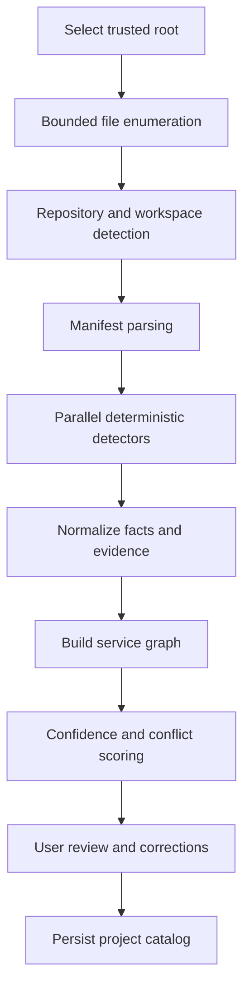

# Release 0.1: Intelligent Project Discovery

## Promise

> Select a directory and receive an evidence-backed map of its repositories, services, runtimes, tools, ports, data stores, and dependencies.

Release 0.1 is StackCendra's first public demonstration and the foundation for environment generation, configuration intelligence, and incident reproduction.

## Scope

### Trusted-root selection

- user explicitly selects a directory;
- desktop app displays the exact scan boundary;
- symlink and junction traversal is constrained;
- standard exclusions are applied and editable;
- the user can cancel a scan;
- no project code is executed.

### Repository discovery

Detect:

- Git worktrees and repository roots;
- nested repositories;
- monorepo workspace boundaries;
- ignored and generated directories;
- default branch and current commit when available;
- uncommitted-state metadata without reading secret values.

### Stack detection

Initial indicators:

| Ecosystem | Evidence |
| --- | --- |
| JavaScript/TypeScript | `package.json`, lockfiles, workspace files |
| Next.js/React | dependencies and framework configuration |
| Express/NestJS | dependencies, bootstrap conventions, configuration |
| Python | `pyproject.toml`, requirements files, framework imports |
| Go | `go.mod`, `go.work`, command packages |
| Rust | `Cargo.toml`, workspace members, binary targets |
| Java | Maven/Gradle files and framework dependencies |
| C/C++ | CMake, Meson, and Make files |
| Infrastructure | Dockerfiles, Compose, Kubernetes, Helm, Terraform, CI workflows |

Every detector declares:

- facts it can emit;
- evidence locations;
- confidence rules;
- supported file versions;
- limits and known false-positive cases.

### Runtime and tool inference

Infer:

- runtime version constraints;
- package manager;
- startup and development commands as proposals only;
- required CLI tools;
- container runtime expectations;
- missing local tools.

Commands from manifests are displayed but never executed during discovery.

### Port and dependency inference

Inspect:

- framework configuration;
- Compose and container definitions;
- environment-variable names and safe default values;
- source declarations for known port APIs;
- connection URL structure without recording credentials;
- service names, hostnames, health checks, and `depends_on` relationships.

Output a directed service graph with evidence for every edge.

## Fact model

Each detected fact contains:

```json
{
  "kind": "service.port",
  "subject": "checkout-api",
  "value": 4000,
  "source": "detector",
  "confidence": 0.96,
  "evidence": [
    {
      "path": "services/checkout/src/main.ts",
      "line": 18,
      "extract_hash": "opaque-content-hash"
    }
  ],
  "observed_at": "RFC3339 timestamp",
  "detector_version": "versioned-detector-id",
  "status": "unconfirmed"
}
```

Sensitive literal values are redacted before persistence. Evidence extracts are minimal and bounded.

## Scan pipeline



## Deterministic first

Release 0.1 does not require an LLM. Deterministic detectors establish the project model. Optional AI can:

- summarize the map;
- explain evidence;
- suggest questions for low-confidence areas.

AI cannot invent facts without labeling them as hypotheses.

## Performance targets

Targets are measured on maintained fixtures:

- first useful results stream within 2 seconds;
- medium repository scan completes within 10 seconds;
- cancellation responds within 500 milliseconds;
- memory use remains bounded on large repositories;
- unchanged files are not reparsed on incremental scans;
- detector failures do not abort unrelated detectors.

Exact repository sizes and hardware profiles must be recorded with benchmark results.

## Acceptance criteria

1. A user selects a directory from the Tauri application.
2. StackCendra discovers all intended fixture repositories without crossing the trusted root.
3. It detects the supported services, runtimes, package managers, ports, and dependencies.
4. Each displayed fact links to a file and location or is explicitly labeled as a hypothesis.
5. Secret-like values are redacted from logs, persistence, and telemetry.
6. No repository script, dependency installation, or network probe occurs.
7. Scan cancellation and exclusions work.
8. A user can correct a result and distinguish the correction from detector output.
9. Rescanning unchanged content is measurably incremental.
10. Windows and Linux fixtures produce equivalent normalized results.
11. Unit, fixture, integration, and security tests pass in CI.
12. The product can export a sanitized project report for the portfolio demonstration.

## Demonstration fixture

Use a purpose-built repository containing:

- Next.js storefront;
- NestJS checkout API;
- Go inventory service;
- Python recommendation service;
- Java payment mock;
- PostgreSQL;
- Redis;
- Docker Compose;
- Kubernetes manifests;
- OpenTelemetry configuration.

Expected output includes five application services, two data services, their dependency edges, required runtimes, and detected ports.

## Out of scope

- generating or writing Dockerfiles;
- starting services or containers;
- probing database connections;
- retrieving secret values;
- scanning outside an approved root;
- uploading repository contents;
- remote repository indexing;
- deployment or cloud-resource discovery;
- unrestricted AI analysis.
