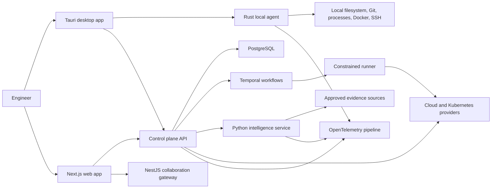

# System Architecture

## Architectural objective

StackCendra separates privileged local or infrastructure execution from collaborative product state and AI analysis. The system should remain understandable on one developer machine while preserving boundaries that can scale into customer-hosted execution.

## System context

## Responsibility boundaries

### Next.js and TypeScript

Own:

- web application routing and rendering;
- product navigation and interactive views;
- server-side web concerns where appropriate;
- shared UI, forms, client state, and query orchestration;
- public documentation and dashboard experience.

Do not own:

- unrestricted local filesystem access;
- long-running workflow execution;
- direct production credentials;
- general-purpose infrastructure reconciliation.

### Tauri 2 and Rust local agent

Own:

- trusted-directory selection and repository discovery;
- local filesystem watching;
- manifest and configuration parsing;
- local Git, process, port, terminal, SSH, keychain, and Docker access;
- encrypted local storage;
- signed, capability-scoped desktop commands.

The Tauri shell and local agent may initially share a Rust process boundary. They separate only when isolation, lifecycle, or update requirements justify it.

### Go control plane

Own:

- projects, environments, infrastructure inventory, deployments, runners, policy coordination, and audit production;
- provider-neutral Docker, Kubernetes, and cloud adapters;
- concurrency limits and infrastructure reconciliation;
- scheduling and target selection.

Begin as a modular monolith. Module boundaries are code and data ownership boundaries before they become deployment boundaries.

### Python intelligence service

Own:

- repository indexing and semantic retrieval;
- AST and symbol extraction beyond local deterministic detection;
- configuration intelligence;
- evidence collection plans;
- log, metric, trace, Git, and deployment correlation;
- hypothesis generation, confidence scoring, and remediation drafts.

The service cannot authorize or directly execute privileged operations.

### NestJS collaboration gateway

Own:

- WebSockets, presence, notifications, approvals, and incident-room state;
- shared collaborative documents and annotations;
- delivery of state changes already authorized by core services.

It does not become the source of truth for infrastructure or audit history.

### Temporal

Own:

- durable long-running workflows;
- retries, timeouts, approvals, resumability, and compensation;
- deployment and incident automation state.

It does not replace deterministic business rules or the audit ledger.

### PostgreSQL

Own:

- transactional platform state;
- relational resource graph;
- outbox events;
- metadata and audit references.

PostgreSQL plus relational edge tables is the initial graph strategy. Neo4j is deferred until measured traversal requirements justify it.

## Communication conventions

- Public APIs: versioned REST described with OpenAPI.
- Internal synchronous APIs: gRPC and Protocol Buffers where cross-language calls justify them.
- User-editable configuration: JSON Schema.
- Events: CloudEvents-inspired envelope with versioned payload schemas.
- Browser and desktop live updates: scoped WebSocket subscriptions.
- Durable integration publication: PostgreSQL transactional outbox.
- Early asynchronous delivery: Redis Streams only where a real consumer exists.

NATS JetStream is deferred until event volume, replay, or service separation makes Redis Streams insufficient.

## Deployment evolution

### Local development

Run the smallest practical topology:

- Next.js;
- Tauri/Rust;
- PostgreSQL;
- optional Redis;
- OpenTelemetry Collector;
- only the service currently under active development.

Temporal, Grafana, Loki, Tempo, and all language services are enabled through explicit profiles rather than consuming resources on every startup.

### Portfolio demonstration

- Vercel or a Node host for the Next.js interface;
- managed PostgreSQL;
- object storage for encrypted or generated artifacts;
- one small VM for persistent Go, Python, NestJS, workers, and telemetry collector;
- local desktop agent on the demonstration device.

### Future production

- stateless services on Kubernetes or an equivalent orchestrator;
- managed PostgreSQL, Redis, KMS, secrets, and telemetry storage;
- customer-hosted runners inside protected networks;
- no public inbound SSH requirement for customer runners.

## Cross-cutting identifiers

Every operation should carry the applicable identifiers:

- `trace_id`;
- `correlation_id`;
- `organization_id`;
- `project_id`;
- `environment_id`;
- `device_id`;
- `actor_id`;
- `workflow_id`;
- `audit_event_id`.

Identifiers are opaque and never embed secrets or personally sensitive data.

## Architecture fitness rules

- UI packages cannot import privileged Rust implementation details.
- provider adapters cannot bypass policy and audit interfaces;
- AI output cannot call runner APIs directly;
- credentials are referenced by opaque IDs, never returned by ordinary APIs;
- new deployment units require an operational justification;
- all external side effects must be idempotent or carry an explicit compensation strategy;
- every event schema is versioned and backward-compatibility is tested.
